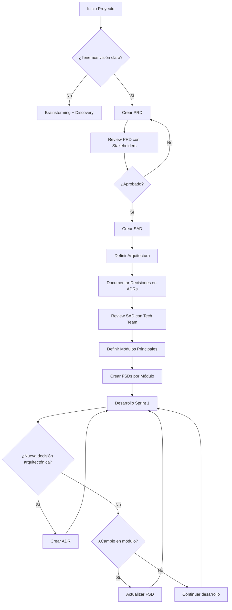
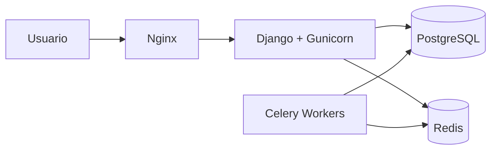

# Marco de Documentación Técnica - 10Code

## Plantillas y Guías de Uso para Proyectos de Software

**Versión:** 1.0  
**Fecha:** Octubre 2025  
**Propósito:** Estandarización de documentación técnica en proyectos 10Code

---

## 📚 Índice

1. [Visión General del Framework](#1-visión-general-del-framework)
2. [PRD - Product Requirements Document](#2-prd---product-requirements-document)
3. [SAD - Software Architecture Document](#3-sad---software-architecture-document)
4. [FSD - Feature Specification Document](#4-fsd---feature-specification-document)
5. [ADR - Architecture Decision Record](#5-adr---architecture-decision-record)
6. [Documentos de Soporte](#6-documentos-de-soporte)
7. [Guía de Uso y Actualización](#7-guía-de-uso-y-actualización)
8. [Checklist para Nuevos Proyectos](#8-checklist-para-nuevos-proyectos)

---

## 1. Visión General del Framework

### 1.1 Jerarquía Documental

```bash
📦 Proyecto
│
├── 📄 PRD (Product Requirements Document)
│   └── Visión de negocio, objetivos, roadmap global
│
├── 🏗️ SAD (Software Architecture Document)
│   └── Arquitectura técnica, stack, decisiones críticas
│
├── 📁 Módulos/Features
│   ├── FSD (Feature Specification Document) - Por módulo
│   ├── user-stories.md (si >20 stories)
│   ├── api-reference.md (si expone APIs)
│   ├── integration-[sistema].md (si integración compleja)
│   └── workflows.md (si workflows complejos)
│
└── 📁 ADRs (Architecture Decision Records)
    └── Decisiones arquitectónicas puntuales (inmutables)
```

### 1.2 Cuándo Usar Cada Documento

| Documento | Cuándo Crearlo | Cuándo Actualizarlo | Audiencia |
|-----------|----------------|---------------------|-----------|
| **PRD** | Inicio del proyecto | Cambios en visión/roadmap | Dirección + Equipo técnico |
| **SAD** | Después del PRD, antes de código | Cambios arquitectónicos mayores | Equipo técnico completo |
| **FSD** | Al iniciar desarrollo de módulo | Cada sprint/iteración del módulo | Developers del módulo |
| **ADR** | Decisión arquitectónica importante | NUNCA (son inmutables) | Tech leads + Arquitectos |
| **Soporte** | Según necesidad del módulo | Según evolución funcional | Developers + QA |

### 1.3 Estructura de Carpetas Estándar

```bash
proyecto/
├── docs/
│   ├── 00-PRD-[NombreProyecto].md          # PRD global
│   ├── 01-SAD-Architecture.md               # SAD completo
│   │
│   ├── modules/                             # Documentación por módulo
│   │   ├── authentication/
│   │   │   ├── FSD-Authentication.md
│   │   │   ├── user-stories.md
│   │   │   └── api-reference.md
│   │   ├── hr-management/
│   │   │   ├── FSD-TimeTracking.md
│   │   │   ├── FSD-Vacations.md
│   │   │   └── integration-odoo.md
│   │   └── [otros-modulos]/
│   │
│   ├── adr/                                 # Architecture Decision Records
│   │   ├── 001-monolith-vs-microservices.md
│   │   ├── 002-django-inertia-choice.md
│   │   ├── 003-tiptap-weasyprint-docs.md
│   │   └── template-adr.md
│   │
│   └── runbooks/                            # Procedimientos operativos
│       ├── deployment.md
│       ├── backup-restore.md
│       └── troubleshooting.md
│
└── [código del proyecto]
```

---

## 2. PRD - Product Requirements Document

### 2.1 Propósito

El **PRD (Product Requirements Document)** es el documento maestro que define **QUÉ** se va a construir y **POR QUÉ**. No profundiza en el **CÓMO** técnico (eso es el SAD y FSDs).

**Audiencia principal:**

- Dirección / Stakeholders (visión de negocio)
- Product Managers (roadmap y priorización)
- Equipo técnico (contexto y objetivos)

**Cuándo actualizarlo:**

- Cambios significativos en visión del producto
- Pivotes en estrategia de negocio
- Nuevas versiones mayores (v2.0, v3.0)
- Trimestral o semestral en revisión de roadmap

---

### 2.2 Plantilla PRD

> [Plantilla de PRD con ejemplos](templates/PRD_template.md)

---

## 3. SAD - Software Architecture Document

### 3.1 Propósito

El **SAD (Software Architecture Document)** define **CÓMO** está construido el sistema a nivel técnico. Es el puente entre la visión de negocio (PRD) y la implementación (código + FSDs).

**Audiencia principal:**

- Arquitectos de software (decisiones de diseño)
- Tech Leads (guía de implementación)
- Developers nuevos (onboarding técnico)
- Auditorías técnicas / Code reviews

**Cuándo actualizarlo:**

- Cambios mayores en arquitectura (ej: monolito → microservicios)
- Adopción de nuevas tecnologías críticas
- Cambios en infraestructura o deployment
- Anualmente en revisión técnica general

---

### 3.2 Plantilla SAD

[Plantilla de SAD con ejemplos](templates/SAD_template.md)

---

## 4. FSD - Feature Specification Document

Feature Specification Document (o Technical Specification)

- **Alcance**: Una app Django específica o grupo de features relacionadas
- **Propósito**: Detalles técnicos de implementación de una funcionalidad
- **Contenido**: Modelos, vistas, lógica de negocio, APIs, flujos de datos
- **Audiencia**: Developers que implementarán esa app

[Plantilla de FSD básica](templates/FSD_template.md)

---

## 5. ADR - Architecture Decision Record

### 5.1 Propósito

Los **ADR (Architecture Decision Records)** documentan decisiones arquitectónicas significativas de forma **inmutable**. Una vez escrito, un ADR nunca se edita - si cambias de opinión, creas un nuevo ADR que supersede al anterior.

**Características:**

- **Atómicos**: Una decisión = Un ADR
- **Inmutables**: No se editan, solo se añaden
- **Numerados secuencialmente**: 001, 002, 003...
- **Formato ligero**: Markdown, conciso

### 5.2 Cuándo Crear un ADR

**SÍ crear ADR:**

- ✅ Elección de framework principal (Django vs Flask vs FastAPI)
- ✅ Patrón arquitectónico (monolito vs microservicios)
- ✅ Base de datos principal (PostgreSQL vs MySQL vs MongoDB)
- ✅ Estrategia de autenticación (OAuth vs JWT vs Session)
- ✅ Herramienta crítica (Celery vs RQ, Redis vs Memcached)

**NO crear ADR:**

- ❌ Nombre de variable o función
- ❌ Librería UI menor (React Select vs Material UI Select)
- ❌ Decisiones reversibles fácilmente
- ❌ Preferencias de estilo de código (eso va en linter config)

### 5.3 Plantilla ADR

[Plantilla de ADR](templates/ADR_template.md)

### 5.4 Ejemplos de ADRs Reales

#### ADR-001: Monolito vs Microservicios

```markdown
# ADR-001: Arquitectura Monolítica Modular

## Metadata
- **Status**: Accepted
- **Fecha**: 2025-01-10
- **Decisor(es)**: CTO, Tech Lead, Arquitecto
- **Tags**: arquitectura, fundacional

---

## Contexto y Problema

10Code necesita construir una intranet integral para gestión de proyectos. El equipo es pequeño (3-4 developers), el presupuesto es limitado, y necesitamos entregar v1.0 en 6 meses. 

**Pregunta:** ¿Debemos construir un monolito o microservicios desde el inicio?

---

## Factores de Decisión

- **Velocidad de desarrollo**: Time-to-market crítico
- **Complejidad operativa**: Equipo pequeño, DevOps limitado
- **Costos infraestructura**: Budget ajustado
- **Escalabilidad futura**: Preparado para crecer pero no ahora
- **Developer Experience**: Facilidad debugging y desarrollo

---

## Opciones Consideradas

### Opción 1: Monolito Modular

**Descripción:** Single Django app con múltiples apps internas modulares, deployment único

**Pros:**
- ✅ Desarrollo más rápido (no overhead de coordinación servicios)
- ✅ Debugging simple (un solo proceso)
- ✅ Transacciones ACID sin complejidad
- ✅ Deployment simple (un solo container)
- ✅ Menos costos infraestructura

**Cons:**
- ❌ Acoplamiento potencial si no se modulariza bien
- ❌ Scaling vertical inicial (hasta que sea necesario)

---

### Opción 2: Microservicios desde Día 1

**Descripción:** Servicios separados (Auth, Projects, Resources, etc.) con API Gateway

**Pros:**
- ✅ Escalabilidad independiente por servicio
- ✅ Tecnologías heterogéneas posibles
- ✅ Teams independientes (cuando crezcamos)

**Cons:**
- ❌ Complejidad operativa alta (orquestación, monitoring)
- ❌ Overhead de desarrollo (APIs, contracts, versioning)
- ❌ Distributed transactions complejas
- ❌ Costos infraestructura altos (múltiples containers, DBs)
- ❌ Debugging difícil (distributed tracing necesario)

---

## Decisión

**Opción elegida**: Monolito Modular

**Justificación:**

Para un equipo de 3-4 developers con deadline de 6 meses, microservicios añade complejidad innecesaria. La estrategia es:

1. **Construir monolito modular**: Apps Django autocontenidas, Service Layer Pattern
2. **Preparar para evolución**: Si en futuro necesitamos escalar, podemos extraer apps a servicios
3. **Enfoque pragmático**: Resolver problemas de negocio ahora, no problemas que no tenemos

Los beneficios de velocidad, simplicidad y costos superan las ventajas teóricas de microservicios que no necesitamos aún.

---

## Consecuencias

### Positivas
- ✅ Entrega más rápida de v1.0
- ✅ Menos bugs por complejidad distribuida
- ✅ Onboarding developers más simple
- ✅ Costos infraestructura 70% menores vs microservicios

### Negativas
- ❌ Si un módulo falla, todo el sistema se ve afectado (mitigable con buen error handling)
- ❌ Scaling inicial solo vertical

### Neutras
- ⚠️ Debemos ser disciplinados en modularidad para permitir extracción futura
- ⚠️ Reevaluar arquitectura cuando lleguemos a 100+ usuarios o 10+ developers

---

## Notas de Implementación

- Apps Django en `apps/` con clara separación de responsabilidades
- Service Layer Pattern obligatorio para lógica de negocio
- Evitar dependencias circulares entre apps
- Monitorear performance y reevaluar decisión en Q4 2025

---

## Referencias

- [Martin Fowler - MonolithFirst](https://martinfowler.com/bliki/MonolithFirst.html)
- [Sam Newman - Monolith to Microservices Book](https://samnewman.io/books/monolith-to-microservices/)

---

## Historial

| Fecha | Evento |
|-------|--------|
| 2025-01-10 | ADR creado y aceptado |
```

---

## 6. Documentos de Soporte

### 6.1 User Stories

**Propósito:** Product backlog organizado por épicas, historias de usuario, y criterios de aceptación.
**Cuándo usar:** Siempre, independientemente del número de historias de usuario de la feature o módulo.

**Plantilla de User Stories:**

[Plantilla de user stories](templates/US_template.md)

### 6.2 API Reference

**Cuándo usar:** Módulos que exponen endpoints REST consumidos por otros sistemas o frontend.

**Plantilla de API reference:**

[Plantilla de API reference](templates/APIREF_template.md)

### 6.3 Integration Specification

**Cuándo usar:** Integraciones complejas con sistemas externos (ODOO, Discord, N8N, etc.)

**Plantilla:**

[Plantilla de Integration reference](templates/INTEGRATION_template.md)

## 7. Guía de Uso y Actualización

### 7.1 Workflow Documentación en Proyecto Nuevo



### 7.2 Cuándo Actualizar Cada Documento

| Documento | Trigger para Actualización | Frecuencia Esperada |
|-----------|----------------------------|---------------------|
| **PRD** | Cambio en visión de producto, roadmap mayor, pivot | Trimestral o menos |
| **SAD** | Cambio arquitectónico significativo, nuevo stack tecnológico | Semestral o menos |
| **FSD** | Nueva feature en módulo, cambio en lógica de negocio | Por sprint si activo |
| **ADR** | Decisión técnica importante (NUNCA editar, solo añadir nuevo) | Ad-hoc cuando necesario |
| **User Stories** | Refinamiento backlog, nuevas funcionalidades | Semanal (backlog grooming) |
| **API Docs** | Nuevo endpoint, cambio en contrato API | Por release |
| **Integration Spec** | Cambio en integración externa, nueva integración | Ad-hoc |

### 7.3 Versionado de Documentos

#### Estrategia de Versionado

```bash
docs/
├── 00-PRD-Intranet-10Code.md           # Living document, versión en metadata
├── 01-SAD-Architecture.md              # Living document, versión en metadata
│
├── modules/
│   └── authentication/
│       └── FSD-Authentication.md       # Versión en metadata + Git history
│
└── adr/
    ├── 001-monolith-choice.md          # INMUTABLE (nunca cambia)
    └── 002-django-inertia.md           # INMUTABLE
```

**Living Documents (PRD, SAD, FSDs):**

- Versión semántica en metadata: `v1.0`, `v1.1`, `v2.0`
- Git history para trackear cambios
- Tabla "Historial de Cambios" al final

**Immutable Documents (ADRs):**

- NO se editan nunca
- Si cambias de opinión, creas ADR nuevo que supersede al anterior
- Status field: `Proposed → Accepted → Deprecated/Superseded`

---

## 8. Checklist para Nuevos Proyectos

### 8.1 Checklist Inicio de Proyecto

```markdown
## 📋 Checklist Documentación - Inicio de Proyecto

### Fase 0: Discovery (Semana 1)
- [ ] Brainstorming con stakeholders
- [ ] Definir usuarios objetivo y pain points
- [ ] Validar viabilidad técnica
- [ ] Estimar timeline y recursos

### Fase 1: Documentación Fundacional (Semana 2-3)
- [ ] **Crear PRD**
  - [ ] Resumen ejecutivo y visión
  - [ ] Usuarios objetivo con personas
  - [ ] Requisitos funcionales de alto nivel
  - [ ] Objetivos y KPIs
  - [ ] Roadmap con fases
  - [ ] Review con dirección → Aprobación

- [ ] **Crear SAD**
  - [ ] Decisión arquitectónica principal (monolito/micro)
  - [ ] Stack tecnológico definido
  - [ ] Diagramas de arquitectura (C4 Context + Container)
  - [ ] Estrategia de datos y seguridad
  - [ ] Review con tech team → Aprobación

- [ ] **Crear ADRs iniciales**
  - [ ] ADR-001: Arquitectura (monolito/micro)
  - [ ] ADR-002: Stack principal (frameworks)
  - [ ] ADR-003: Base de datos
  - [ ] ADR-004+: Otras decisiones críticas

- [ ] **Setup infraestructura docs**
  - [ ] Crear estructura de carpetas en `/docs/`
  - [ ] Añadir templates en `/docs/templates/`
  - [ ] Configurar README.md con links a docs principales

### Fase 2: Planificación Módulos (Semana 4)
- [ ] **Identificar módulos v1.0**
  - [ ] Listar módulos principales
  - [ ] Definir dependencies entre módulos
  - [ ] Priorizar con MoSCoW

- [ ] **Crear FSDs módulos críticos**
  - [ ] FSD para módulo más crítico (ej: Autenticación)
  - [ ] FSD para siguiente módulo prioritario
  - [ ] Resto de FSDs pueden crearse antes de cada sprint

### Fase 3: Desarrollo (Ongoing)
- [ ] **Por cada sprint:**
  - [ ] Actualizar FSDs de módulos en desarrollo
  - [ ] Crear ADR si hay decisión arquitectónica
  - [ ] Actualizar API docs si expones endpoints
  - [ ] Refinar user stories en backlog

- [ ] **Por cada release mayor:**
  - [ ] Actualizar PRD si cambió roadmap
  - [ ] Actualizar SAD si cambió arquitectura
  - [ ] Review general de docs vs realidad

### Fase 4: Post-Launch (Ongoing)
- [ ] **Mantenimiento:**
  - [ ] Review trimestral de PRD
  - [ ] Review semestral de SAD
  - [ ] ADRs solo cuando necesario (no cambiar existentes)
  - [ ] FSDs actualizados por sprint
```

### 8.2 Checklist Review de Documentación

```markdown
## 🔍 Checklist Review Trimestral de Documentación

**Fecha:** _______________
**Reviewer:** _______________

### PRD
- [ ] Visión del producto sigue vigente
- [ ] Objetivos y KPIs actualizados
- [ ] Roadmap refleja realidad actual
- [ ] Usuarios objetivo no han cambiado
- [ ] Requisitos no funcionales cumpliéndose
- [ ] Riesgos actualizados

### SAD
- [ ] Arquitectura no ha cambiado significativamente
- [ ] Stack tecnológico no ha cambiado
- [ ] Diagramas reflejan realidad del código
- [ ] Decisiones arquitectónicas documentadas en ADRs
- [ ] Performance targets cumpliéndose

### FSDs
- [ ] Módulos implementados tienen FSD
- [ ] FSDs reflejan código actual
- [ ] Nuevas features documentadas
- [ ] User stories actualizadas

### ADRs
- [ ] Decisiones recientes documentadas
- [ ] ADRs antiguos marcados como superseded si aplica
- [ ] No hay decisiones importantes sin ADR

### Acciones Correctivas
- [ ] Documentos desactualizados identificados
- [ ] Plan de actualización definido
- [ ] Responsables asignados
```

---

## 9. Herramientas Recomendadas

### 9.1 Edición y Colaboración

| Herramienta | Propósito | Por qué |
|-------------|-----------|---------|
| **VS Code** | Editor principal | Markdown preview, Git integrado |
| **Obsidian** | Knowledge base | Graph view, backlinking |
| **Google Docs** | Colaboración equipo | Comments, asignaciones |
| **GitHub** | Versionado + Review | Pull requests para docs críticos |
| **Mermaid.js** | Diagramas | Código → Diagrama, versionable |

### 9.2 Generación de Diagramas

<!-- Ejemplo Mermaid en Markdown -->

### Arquitectura del Sistema



### 9.3 Linting de Documentación

```yaml
# .github/workflows/docs-lint.yml
name: Lint Documentation

on:
  pull_request:
    paths:
      - 'docs/**/*.md'

jobs:
  markdownlint:
    runs-on: ubuntu-latest
    steps:
      - uses: actions/checkout@v3
      
      - name: Lint Markdown
        uses: DavidAnson/markdownlint-cli2-action@v9
        with:
          globs: 'docs/**/*.md'
      
      - name: Check broken links
        uses: gaurav-nelson/github-action-markdown-link-check@v1
        with:
          use-quiet-mode: 'yes'
```

---

## 10. FAQ

### ¿Debo crear todos los FSDs antes de empezar a desarrollar?

**No.** Crea FSDs de forma iterativa:

- **Antes del proyecto**: FSD del módulo más crítico (ej: Auth)
- **Antes de cada sprint**: FSD de módulos que desarrollarás ese sprint
- **Durante desarrollo**: Actualiza FSD si descubres que la realidad difiere

### ¿Qué pasa si el código diverge de la documentación?

**Opciones:**

1. **Código correcto, doc desactualizada**: Actualiza doc (más común)
2. **Doc correcta, código incorrecto**: Refactoriza código
3. **Ambos incorrectos**: Review y decide con equipo

**Regla de oro**: La documentación debe reflejar la **intención** (el "por qué") incluso si el código aún no la cumple perfectamente.

### ¿Debo documentar TODO en FSDs?

**No.** FSDs son para **decisiones de diseño**, no para documentar cada línea de código. El código bien escrito es auto-documentado. Usa FSDs para:

- Reglas de negocio no obvias
- Flujos complejos
- Integraciones
- Decisiones de diseño

### ¿Cuántos ADRs son "demasiados"?

**No hay límite**, pero típicamente:

- Proyecto pequeño: 5-10 ADRs en primer año
- Proyecto mediano: 10-20 ADRs en primer año
- Proyecto grande: 20-50 ADRs en primer año

Si tienes >100 ADRs en un año, probablemente estás sobre-documentando.

---

## 12. Conclusión

Este marco de documentación te proporciona:

✅ **Claridad**: Roles claros para cada tipo de documento
✅ **Consistencia**: Plantillas estandarizadas
✅ **Escalabilidad**: Funciona desde 1 developer hasta equipos grandes
✅ **Pragmatismo**: No burocracia innecesaria

**Siguiente paso:** Usa el [Checklist 8.1](#81-checklist-inicio-de-proyecto) para iniciar tu documentación.

---

**Mantenedor:** Equipo de Producto de 10Code  
**Última actualización:** Diciembre 2025  
**Versión framework:** 1.0

---
