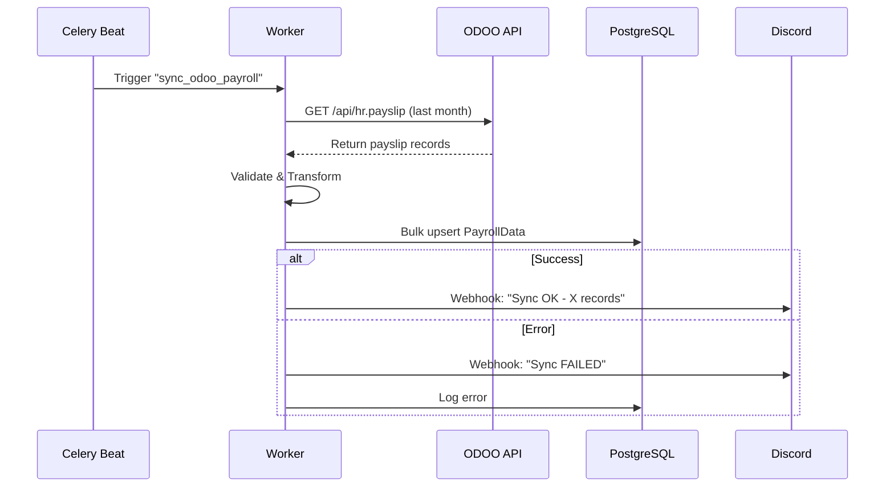

# Integración: ODOO ERP

## 1. Visión General

Sincronización bidireccional de datos financieros y de empleados entre ODOO ERP y la intranet 10Code.

**Sistemas involucrados:**

- **ODOO v14**: Sistema ERP autoridad para nóminas y facturación
- **Intranet 10Code**: Sistema autoridad para proyectos y asignaciones

**Dirección de datos:**

- ODOO → Intranet: Nóminas, facturas, datos de empleados
- Intranet → ODOO: Horas imputadas, proyectos para facturación

---

## 2. Configuración ODOO

### 2.1 Módulos Requeridos

- `hr_payroll` v14.0+
- `account` v14.0+
- `project` v14.0+

### 2.2 Generar API Key

1. Login como administrador
2. Settings → Users → [Tu usuario] → Preferences
3. Security → Generate API Key
4. Copiar API key a `.env` de intranet:

   ```toml

   ODOO_URL=<https://10code.odoo.com>
   ODOO_DB=production
   ODOO_USERNAME=<intranet_sync@10code.es>
   ODOO_API_KEY=xxxxxxxxxxxxx

   ```

---

## 3. Mapeo de Datos

### 3.1 Empleados

| ODOO Field | Intranet Model | Transformación | Dirección |
|------------|----------------|----------------|-----------|
| `employee_id` | `User.employee_id` | Directo | ODOO → Intranet |
| `name` | `User.first_name + last_name` | Split por espacio | ODOO → Intranet |
| `work_email` | `User.email` | Directo | ODOO → Intranet |
| `employee_type` | `User.employment_type` | Mapeo enum | ODOO → Intranet |

### 3.2 Nóminas

| ODOO Field | Intranet Model | Transformación | Dirección |
|------------|----------------|----------------|-----------|
| `gross_salary` | `PayrollData.gross_salary` | Encriptado | ODOO → Intranet |
| `period` | `PayrollData.period_month` | Date parsing | ODOO → Intranet |

---

## 4. Flujos de Sincronización

### 4.1 Sincronización Mensual de Nóminas

**Trigger:** Celery Beat task - 1er día de cada mes a las 03:00 AM

**Flujo:**



**Código relevante:**

```python
# apps/integrations/tasks.py
@shared_task
def sync_odoo_payroll():
    # Ver código en FSD-Integrations.md
    pass
```

---

## 5. Manejo de Errores

### 5.1 Errores Comunes

| Error | Causa | Solución |
|-------|-------|----------|
| `401 Authentication Failed` | API key inválida o expirada | Regenerar API key en ODOO |
| `500 Internal Server Error` | ODOO temporalmente caído | Retry automático con backoff |
| `Data validation error` | Campos requeridos faltantes | Verificar mapeo de campos |

### 5.2 Retry Strategy

```python
@shared_task(bind=True, max_retries=3, default_retry_delay=60)
def sync_odoo_payroll(self):
    try:
        # sync logic
    except OdooAPIError as exc:
        raise self.retry(exc=exc, countdown=60 * (2 ** self.request.retries))
```

---

## 6. Testing

### 6.1 Test de Integración

```python
# apps/integrations/tests/test_odoo.py
@pytest.mark.integration
def test_odoo_payroll_sync_success(mocker):
    # Mock ODOO API response
    mock_response = {...}
    mocker.patch('apps.integrations.odoo.OdooClient.get_payslips', return_value=mock_response)
    
    # Run sync
    result = sync_odoo_payroll()
    
    assert result['status'] == 'success'
    assert PayrollData.objects.count() == 45
```

---

## 7. Monitoreo

### 7.1 Métricas

- **Latencia sincronización**: <10 min target
- **Success rate**: >99.5%
- **Registros sincronizados/mes**: ~50 (nóminas)

### 7.2 Alertas

- **Fallo 3 syncs consecutivos** → Alerta a #tech-ops
- **Latencia >30 min** → Alerta a #tech-ops
- **Data inconsistency detectada** → Alerta a #finance + #tech

## 8. Runbook Operacional

### Sync manual forzado

```bash
docker-compose exec web python manage.py shell
>>> from apps.integrations.tasks import sync_odoo_payroll
>>> sync_odoo_payroll.apply_async()
```

### Verificar última sincronización

```python
from apps.integrations.models import SyncLog
last_sync = SyncLog.objects.filter(integration='odoo_payroll').latest('created_at')
print(f"Last sync: {last_sync.created_at} - Status: {last_sync.status}")
```

---

## 9. Referencias

- [ODOO API Documentation](https://www.odoo.com/documentation/14.0/developer/reference/external_api.html)
- [Confluence: ODOO Access Credentials](https://10code.atlassian.net/...)
