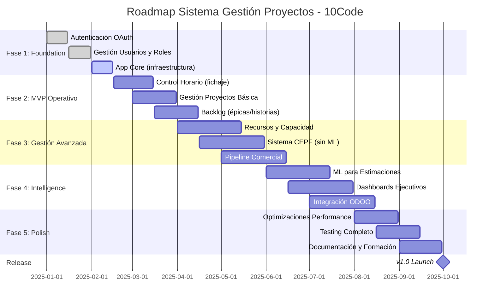

# PRD: [Nombre del Producto/Proyecto]

## Metadata

- **Versión del documento**: 1.0
- **Fecha de creación**: [fecha]
- **Última actualización**: [fecha]
- **Owner/Autor**: [nombre]
- **Revisores**: [lista de revisores]
- **Estado**: [Draft / In Review / Approved / Living Document]

---

## 1. Resumen Ejecutivo

### 1.1 Visión del Producto

[2-3 párrafos describiendo la visión de alto nivel del producto]

**Ejemplo:**
> El Sistema de Gestión de Proyectos Integral de 10Code es una plataforma interna monolítica que centraliza y optimiza todo el ciclo de vida de proyectos tecnológicos. Desde la captación comercial hasta el cierre y retrospectiva, el sistema integra Machine Learning para estimaciones precisas, gestión de recursos en tiempo real, y cumplimiento normativo español en control horario. La visión es eliminar herramientas fragmentadas (Jira, hojas de cálculo, emails) y proporcionar una única fuente de verdad que mejore la rentabilidad, transparencia y eficiencia operativa.

### 1.2 Problema que Resuelve

- **Pain point 1**: [Descripción del problema actual]
- **Pain point 2**: [...]
- **Pain point 3**: [...]

**Ejemplo:**

- **Estimaciones imprecisas**: Las estimaciones comerciales actuales tienen +/-40% error, causando sobrecostes y pérdida de rentabilidad
- **Recursos sobrecargados**: No hay visibilidad centralizada de capacidad, causando burnout y conflictos de asignación
- **Incumplimiento normativo**: Control horario manual no cumple normativa española 2025, exponiendo a multas

### 1.3 Propuesta de Valor

[¿Qué hace único a este producto? ¿Qué beneficios tangibles aporta?]

**Ejemplo:**

- **Estimaciones ML con 80% confianza**: Reduce incertidumbre comercial y mejora márgenes
- **Vista 360° de recursos**: Optimiza asignaciones y previene burnout
- **Cumplimiento automático**: Fichaje digital con trazabilidad completa RGPD

---

## 2. Contexto y Alcance

### 2.1 Contexto del Negocio

[Situación actual de la organización, mercado, competencia si aplica]

**Ejemplo:**
> 10Code es una consultora tecnológica española con 50 empleados que gestiona 10-15 proyectos simultáneos. Actualmente usa Jira para desarrollo, ODOO para finanzas, y hojas de cálculo para recursos. Esta fragmentación genera:
>
> - 5h/semana por PM en reportes manuales
> - 15% error en facturación por imputaciones incorrectas
> - Decisiones reactivas vs proactivas por falta de datos

### 2.2 Usuarios Objetivo

#### Usuario Primario 1: Director de Operaciones

- **Perfil**: Responsable de rentabilidad y eficiencia operativa
- **Goals**: Maximizar utilización de recursos, detectar proyectos en riesgo
- **Pain points**: Sin visibilidad tiempo real, reportes manuales desactualizados
- **Necesidades clave**: Dashboards ejecutivos, alertas proactivas, simulación escenarios

#### Usuario Primario 2: Gestor de Proyecto (PM/Scrum Master)

- **Perfil**: Lidera equipos de 3-7 personas en proyectos tecnológicos
- **Goals**: Entregar a tiempo y presupuesto, mantener equipo motivado
- **Pain points**: Sobrecarga administrativa, herramientas desconectadas
- **Necesidades clave**: Tableros Kanban unificados, burndown automático, registro tiempo simple

[Continuar con otros roles clave: Technical Leads, Comerciales, Developers, RRHH...]

### 2.3 Alcance del Proyecto

#### En Alcance (v1.0)

- ✅ Gestión de estructura organizativa (equipos, personas, roles)
- ✅ Pipeline comercial desde leads hasta contratos
- ✅ Planificación y seguimiento de proyectos con metodologías ágiles
- ✅ Sistema CEPF + ML para estimaciones
- ✅ Control horario con cumplimiento normativo español
- ✅ Gestión de backlog (épicas, historias, tareas)
- ✅ Dashboard de rentabilidad en tiempo real
- ✅ Integración ODOO (nóminas/facturación)

#### Fuera de Alcance (v1.0, evaluable en v2.0)

- ❌ Gestión de inventario y materiales
- ❌ Sistema de formación y academy
- ❌ CRM avanzado con lead scoring ML
- ❌ App móvil nativa
- ❌ Portal de clientes externo
- ❌ Integración con herramientas de diseño (Figma)

#### Deuda Técnica Conocida

[Listar compromisos técnicos asumidos conscientemente para v1.0]

---

## 3. Objetivos y Métricas de Éxito

### 3.1 Objetivos de Negocio

| Objetivo | Métrica | Target v1.0 | Método de Medición |
|----------|---------|-------------|-------------------|
| Mejorar precisión estimaciones | Error estimación vs real | <20% en 80% proyectos | Comparar horas estimadas vs imputadas |
| Reducir sobrecarga PM | Horas admin por proyecto | -50% (de 10h a 5h/semana) | Time tracking categorizado |
| Aumentar utilización recursos | % utilización promedio | 75-85% rango óptimo | Horas imputadas / disponibles |
| Cumplimiento normativo | Incidencias fichaje | 0 multas, <5% incidencias | Auditorías Inspección Trabajo |
| Mejorar rentabilidad | Margen promedio proyectos | +10% vs baseline | Facturado - costes reales |

### 3.2 Objetivos de Producto

| Objetivo | Métrica | Target v1.0 |
|----------|---------|-------------|
| Adopción usuarios | % empleados activos semanalmente | >90% |
| Satisfacción usuarios | NPS (Net Promoter Score) | >40 |
| Time-to-value | Días desde onboarding hasta uso productivo | <3 días |
| Performance | p95 tiempo carga vistas principales | <300ms |
| Disponibilidad | Uptime del sistema | >99.5% |

### 3.3 KPIs Operativos

**Métricas a implementar en el sistema:**

- **Comerciales**: Tasa conversión leads, valor pipeline, tiempo cierre
- **Proyectos**: Velocidad equipos, burndown accuracy, desviación presupuesto
- **Recursos**: Utilización por persona, distribución carga, alertas sobreasignación
- **Financiero**: Margen por proyecto, costo hora real, facturación pendiente
- **Calidad**: Bugs por sprint, tech debt ratio, test coverage

---

## 4. Requisitos Funcionales de Alto Nivel

[Describir módulos principales sin entrar en detalles técnicos. Los detalles están en FSDs.]

### 4.1 Módulo: Gestión Comercial

**Propósito**: Gestionar pipeline desde leads hasta contratos firmados

**Funcionalidades clave:**

- Captación de leads (manual, webhook N8N, importación)
- Cualificación y enriquecimiento automático
- Funnel de ventas con etapas configurables
- Generación de ofertas con estimaciones CEPF+ML
- Gestión de contratos y requisitos
- Integración con sistema de proyectos

**User Stories principales:**

- Como Comercial, quiero estimar rápidamente un proyecto sin depender de técnicos
- Como Director Comercial, quiero visualizar el pipeline y tasas de conversión
- Como Comercial, quiero generar ofertas profesionales en <30min

[Repetir para cada módulo principal: RRHH, Gestión de Proyectos, Control Horario, etc.]

---

## 5. Requisitos No Funcionales

### 5.1 Rendimiento

- Tiempo de carga vistas principales: <300ms p95
- Tiempo de generación estimaciones ML: <5s
- Sincronización ODOO: <10min latencia
- Capacidad: Soportar 100 usuarios simultáneos sin degradación

### 5.2 Seguridad

- Autenticación OAuth 2.0 con Google Workspace
- Restricción por dominio corporativo (@10code.es)
- RBAC granular por módulo y acción
- Encriptación datos sensibles (salarios, costes)
- Cumplimiento RGPD by design
- Auditoría de accesos a datos críticos

### 5.3 Usabilidad

- Mobile-first responsive design
- Drag & drop en operaciones comunes
- Navegación contextual entre módulos
- Accesos rápidos basados en rol
- Notificaciones inteligentes sin saturar
- Onboarding < 1 hora para nuevo usuario

### 5.4 Escalabilidad

- Arquitectura preparada para >200 usuarios
- Separación ETL mediante jobs asíncronos (Celery)
- Cache estratégico para dashboards
- Infraestructura Dockerizada para escalar horizontalmente

### 5.5 Mantenibilidad

- Código Python tipado con type hints
- Cobertura tests >80% en lógica crítica
- Documentación inline en funciones complejas
- Arquitectura modular por dominios de negocio
- Migraciones Django versionadas

### 5.6 Cumplimiento Normativo

- **Normativa española control horario 2025**:
  - Fichaje digital obligatorio con trazabilidad
  - Almacenamiento 4 años
  - Acceso Inspección de Trabajo
  - RGPD: consentimiento, portabilidad, derecho olvido
- **RGPD**: Consentimientos explícitos, encriptación, auditoría

---

## 6. Restricciones y Suposiciones

### 6.1 Restricciones Técnicas

- Backend: Django 5 + PostgreSQL 15 (stack existente)
- Frontend: React + Inertia.js (monolito, no microservicios)
- Infraestructura: Docker + deployment on-premise inicial
- Autenticación: Google OAuth (todos empleados tienen cuenta @10code.es)
- Presupuesto: Desarrollo interno, sin licencias externas caras

### 6.2 Restricciones de Negocio

- Timeline: v1.0 funcional en 6 meses
- Equipo: 3-4 developers full-time
- Migración: Datos históricos de Jira + ODOO deben importarse
- Continuidad: No puede interrumpir operaciones actuales durante transición

### 6.3 Suposiciones

- Todos los usuarios tienen acceso a internet estable
- Todos los usuarios están familiarizados con metodologías ágiles
- ODOO continuará siendo sistema financiero autoridad
- Google Workspace seguirá siendo proveedor OAuth

### 6.4 Dependencias Externas

- Disponibilidad API ODOO v14+
- Estabilidad Google OAuth
- Discord webhooks para notificaciones
- Servicio SMTP para emails (Gmail)

---

## 7. Roadmap y Fases de Desarrollo

### 7.1 Hitos Principales

### 7.2 Detalle por Fase

#### **Fase 1: Foundation** (1.5 meses)

**Objetivo**: Infraestructura base, autenticación, gestión de usuarios

**Entregables:**

- Sistema de autenticación OAuth funcional
- RBAC básico con roles principales
- App core con models abstractos, utils, middleware
- Despliegue Docker funcional en dev

**Criterios de éxito:**

- ✅ Todos los empleados pueden login con @10code.es
- ✅ Roles asignables y permisos funcionan
- ✅ CI/CD básico configurado

#### **Fase 2: MVP Operativo** (2 meses)

**Objetivo**: Funcionalidad mínima para reemplazar herramientas críticas actuales

**Entregables:**

- Sistema de fichaje digital cumpliendo normativa
- Gestión básica de proyectos (crear, asignar equipo, estados)
- Backlog con épicas, historias, tareas
- Tablero Kanban simple

**Criterios de éxito:**

- ✅ 100% empleados fichando en el sistema
- ✅ 3 proyectos piloto gestionados completamente
- ✅ Reducción 20% tiempo admin PMs

[Continuar con Fases 3, 4, 5...]

### 7.3 Priorización (MoSCoW)

#### Must Have (v1.0)

- Autenticación y RBAC
- Control horario normativo
- Gestión proyectos + backlog
- Estimaciones CEPF (sin ML inicial)
- Gestión de recursos
- Dashboard rentabilidad básico

#### Should Have (v1.0 si tiempo permite)

- ML para estimaciones
- Pipeline comercial completo
- Integración ODOO bidireccional
- Reportes avanzados

#### Could Have (v1.1)

- Notificaciones Discord avanzadas
- Gestión de vacaciones compleja
- Retrospectivas y lecciones aprendidas
- Mobile app

#### Won't Have (v1.x, evaluable v2.0)

- Sistema de formación/academy
- CRM con lead scoring ML
- Portal clientes externo
- Integraciones diseño (Figma)

---

## 8. Riesgos e Mitigaciones

### 8.1 Riesgos Técnicos

| Riesgo | Probabilidad | Impacto | Mitigación |
|--------|--------------|---------|------------|
| ML estimaciones no mejora precisión | Media | Alto | Fallback a CEPF manual, iterar modelo con más datos |
| Performance degradación con >50 usuarios | Media | Medio | Load testing desde fase 3, optimización proactiva |
| Integración ODOO falla frecuentemente | Alta | Alto | Sistema funcional sin integración, datos manuales temporalmente |
| Migración datos Jira pierde información | Media | Medio | Backup completo, validación manual, periodo de transición |

### 8.2 Riesgos de Negocio

| Riesgo | Probabilidad | Impacto | Mitigación |
|--------|--------------|---------|------------|
| Resistencia al cambio de usuarios | Alta | Alto | Change management, formación, onboarding cuidadoso |
| Prioridades cambian mid-project | Media | Medio | Roadmap flexible, sprints cortos, comunicación continua |
| Recursos de desarrollo insuficientes | Media | Alto | Priorización estricta MoSCoW, outsourcing puntual si crítico |
| Normativa control horario cambia | Baja | Alto | Arquitectura flexible, seguimiento legislativo continuo |

---

## 9. Plan de Lanzamiento y Adopción

### 9.1 Estrategia de Rollout

#### Fase Beta (1 mes antes de v1.0)

- **Usuarios beta**: 10-15 early adopters voluntarios (1 PM, 2 developers, 1 comercial, dirección)
- **Objetivo**: Validar UX, detectar bugs críticos, refinar workflows
- **Success criteria**: NPS >30, <10 bugs críticos, 80% tareas completables

#### Fase Piloto (Launch v1.0)

- **Usuarios piloto**: 1-2 equipos completos (15-20 personas)
- **Duración**: 1 mes
- **Operación**: Dual-track (sistema nuevo + herramientas antiguas en paralelo)
- **Objetivo**: Validar en condiciones reales, ajustar antes rollout completo

#### Fase Rollout Completo (1-2 meses post-launch)

- **Estrategia**: Por equipos/departamentos de forma escalonada
- **Apoyo**: Sesiones formación, office hours diarias, documentación actualizada
- **Objetivo**: 90% adopción, sunset completo herramientas antiguas

### 9.2 Plan de Formación

| Rol | Duración | Contenido | Formato |
|-----|----------|-----------|---------|
| Todos | 1h | Navegación básica, fichaje, perfil | Video + hands-on |
| PMs/Scrum Masters | 3h | Gestión proyectos, backlog, recursos | Workshop práctico |
| Comerciales | 2h | Pipeline, estimaciones, generación ofertas | Demo + practice |
| Dirección | 1.5h | Dashboards, KPIs, reportes | Presentación + Q&A |
| RRHH | 2h | Gestión usuarios, vacaciones, fichajes | Tutorial + casos reales |

### 9.3 Soporte Post-Lanzamiento

- **Slack channel**: #soporte-intranet para dudas rápidas
- **Office hours**: 2h diarias primera semana, luego 3x/semana
- **Documentación**: Wiki completo con FAQs, tutoriales, troubleshooting
- **Feedback loop**: Encuestas semanales primeras 4 semanas

---

## 10. Anexos

### 10.1 Glosario de Términos

| Término | Definición |
|---------|------------|
| **CEPF** | Cocomo Estimation Points Framework - Metodología estimación basada en puntos función |
| **Carry-over** | Transferencia de días de vacaciones no disfrutados al siguiente año |
| **Drag & drop** | Interfaz arrastrar y soltar para reasignación rápida |
| **ETL** | Extract, Transform, Load - Proceso de integración de datos |
| **NPS** | Net Promoter Score - Métrica de satisfacción usuario |
| **RBAC** | Role-Based Access Control - Control de acceso basado en roles |
| **SLA** | Service Level Agreement - Acuerdo de nivel de servicio |

### 10.2 Referencias

- [Normativa Control Horario España 2025](...)
- [Guía RGPD para SaaS](...)
- [Django 5 Best Practices](...)
- [Inertia.js Documentation](...)

### 10.3 Historial de Cambios

| Versión | Fecha | Autor | Cambios |
|---------|-------|-------|---------|
| 1.0 | 2025-01-15 | [Nombre] | Versión inicial aprobada |
| 1.1 | 2025-03-20 | [Nombre] | Añadido módulo comercial a v1.0, movido academy a v2.0 |

---

**Documento aprobado por:**

- [ ] Director de Operaciones
- [ ] CTO / Tech Lead
- [ ] Product Manager
- [ ] Representante Usuarios

**Fecha de aprobación**: _________________
