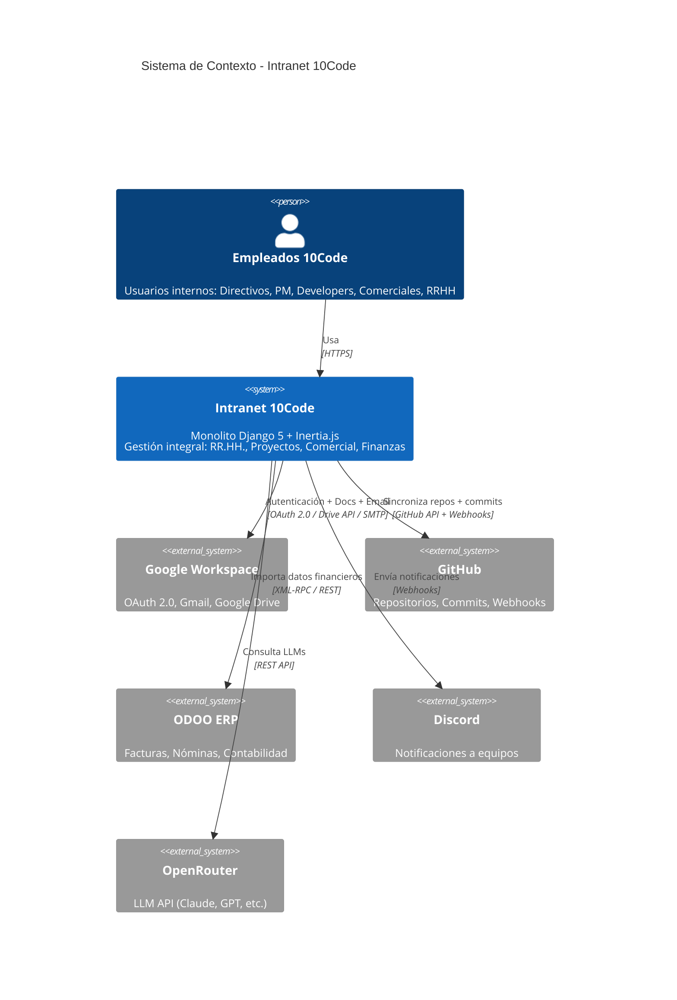
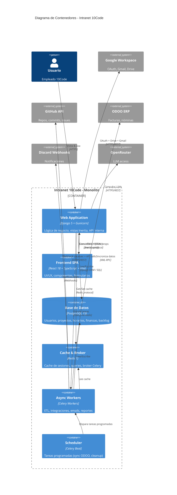

# SAD: Software Architecture Document

## Intranet 10Code - Sistema Integral de Gestión Empresarial

## Metadata

- **Versión del documento**: 1.0
- **Fecha de creación**: 2024-11-14
- **Última actualización**: 2024-11-14
- **Arquitecto principal**: Juanje Márquez - 10Code
- **Revisores técnicos**: Pendiente
- **Estado**: Living Document

---

## 1. Introducción

### 1.1 Propósito del Documento

Este documento describe la arquitectura de software de la **Intranet 10Code - Sistema Integral de Gestión Empresarial**. Define las decisiones arquitectónicas clave, el stack tecnológico, patrones de diseño, y lineamientos técnicos para el desarrollo.

**Audiencia:** Desarrollador principal (Juanje), agentes de IA de codificación, futuros desarrolladores del equipo, mantenedores del sistema.

### 1.2 Alcance

Este SAD cubre:

- ✅ Arquitectura de alto nivel (sistema completo)
- ✅ Stack tecnológico con justificaciones técnicas
- ✅ Patrones de diseño y comunicación entre módulos
- ✅ Estructura de código y organización de apps Django
- ✅ Estrategias de datos, seguridad, performance, testing
- ✅ Infraestructura, deployment y CI/CD

Este SAD **NO** cubre:

- ❌ Detalles de implementación por módulo (ver FSDs específicos)
- ❌ Requisitos funcionales de negocio (ver PRD)
- ❌ Manuales de usuario o documentación operativa
- ❌ Historias de usuario específicas (ver FSDs)

### 1.3 Referencias

- **PRD**: [PRD_Intranet_10Code.md](./PRD_Intranet_10Code.md)
- **ADRs relacionados**: Ver carpeta `/docs/adr/` (a crear durante desarrollo)
- **Guía de desarrollo**: [intranet_dev_guide.md](./intranet_dev_guide.md)
- **Reglas arquitectónicas**: [ARCHITECTURE_RULES.md](./ARCHITECTURE_RULES.md)
- **Marco de documentación**: [marco-documentacion-tecnica-10code.md](./marco-documentacion-tecnica-10code.md)

---

## 2. Visión Arquitectónica

### 2.1 Filosofía Arquitectónica: Monolito Modular Majestuoso

El sistema sigue el patrón **"Majestic Modular Monolith"**, una arquitectura que combina lo mejor de ambos mundos:

**¿Por qué Monolito?**

- ✅ **Simplicidad operativa**: Single deployment unit, un solo proceso a desplegar
- ✅ **Velocidad de desarrollo**: Sin overhead de comunicación entre servicios
- ✅ **Transacciones ACID**: Integridad de datos garantizada sin distributed transactions
- ✅ **Debugging simple**: Stack trace completo, no hay network calls misteriosos
- ✅ **Equipo pequeño**: Un desarrollador principal puede gestionar todo el sistema
- ✅ **Infraestructura mínima**: PostgreSQL + Redis, sin orquestadores complejos

**¿Por qué NO Microservicios (ahora)?**

- ❌ Complejidad operativa prematura innecesaria
- ❌ Overhead en comunicación entre servicios (latencia, serialización)
- ❌ Gestión de datos distribuidos compleja
- ❌ Fricción en desarrollo para equipo de 1 persona + agentes IA
- ❌ Necesidad de orquestadores (Kubernetes), service mesh, etc.

#### **Modularidad Interna (La Clave del "Majestuoso")**

Aunque es un monolito físico, internamente está estructurado como microservicios lógicos:

- 📦 **Apps Django autocontenidas**: Cada módulo es un "bounded context" en DDD
- 🔒 **Interfaces claras**: Service Layer como API interna entre módulos
- 🧩 **Bajo acoplamiento**: Comunicación explícita, no importaciones salvajes
- 🏗️ **Alta cohesión**: Todo el código de un dominio junto
- 🚀 **Preparado para MSA futuro**: Si escala a SaaS, extraer apps es factible

#### **Habilitador Clave: Inertia.js**

Inertia.js elimina la complejidad de mantener una API REST separada:

- **Frontend moderno (React SPA)** + **Backend tradicional (Django server-rendered)**
- Sin necesidad de serializers DRF, endpoints REST, gestión de estado compleja
- Backend envía props JSON directamente a componentes React
- Navegación SPA sin página completa reload
- Simplifica testing: No hay dos codebases (API + Frontend) a testear

### 2.2 Principios Guía SOLID & Best Practices

1. **KISS (Keep It Simple, Stupid)**: Priorizar simplicidad sobre sofisticación prematura
2. **YAGNI (You Ain't Gonna Need It)**: No construir funcionalidad hasta que sea necesaria
3. **DRY (Don't Repeat Yourself)**: Código reutilizable, evitar duplicación
4. **Separation of Concerns**: Service Layer separa lógica de negocio de views/models
5. **Convention over Configuration**: Seguir estándares Django/React donde sea posible
6. **Fail Fast**: Validaciones tempranas, errores explícitos mejor que silenciosos
7. **Explicit > Implicit**: Type hints, nombres claros, docstrings

### 2.3 Arquitectura de Alto Nivel (C4 Model - Context)



**Flujo de Datos Principal:**

1. Usuario se autentica con Google OAuth (@10code.es)
2. Navega SPA (Inertia.js) sin recargas de página
3. Django procesa requests, consulta PostgreSQL, cachea en Redis
4. Tareas pesadas (sincronizaciones, ML) se ejecutan en Celery workers
5. Integraciones externas (GitHub, ODOO, Drive) vía APIs REST/Webhooks
6. LLMs consultados vía OpenRouter para estimaciones y asistencia

### 2.4 Decisiones Arquitectónicas Críticas

Las siguientes decisiones tienen **ADRs detallados** que se crearán en `/docs/adr/`:

| ID  | Decisión | Justificación Breve | Estado ADR |
|-----|----------|---------------------|------------|
| ADR-001 | **Monolito vs Microservicios** | Equipo pequeño, complejidad innecesaria, deployment simple | Pendiente |
| ADR-002 | **Django + Inertia.js** | Elimina API REST duplicada, desarrollo más rápido, DX superior | Pendiente |
| ADR-003 | **PostgreSQL** | JSONB para flexibilidad, robustez, excelente soporte Django ORM | Pendiente |
| ADR-004 | **uv como gestor de dependencias** | 10-100x más rápido que pip, compatible con pyproject.toml | Pendiente |
| ADR-005 | **Tiptap + WeasyPrint** | Editor moderno WYSIWYG, generación PDF server-side confiable | Pendiente |
| ADR-006 | **Celery + Redis** | Tareas asíncronas (ETL, integraciones), cache distribuido | Pendiente |
| ADR-007 | **OpenRouter para LLMs** | Acceso multi-modelo, cost-effective, sin vendor lock-in | Pendiente |
| ADR-008 | **Service Layer Pattern** | Desacoplamiento, transacciones, testabilidad, evolución a async | Pendiente |

---

## 3. Stack Tecnológico

### 3.1 Resumen Visual del Stack

```bash
┌─────────────────────────────────────────────────────────────┐
│                      FRONTEND (Client)                       │
│  React 18 + TypeScript + Inertia.js Client                  │
│  UI: Tailwind CSS + shadcn/ui components                    │
│  Editor: Tiptap (WYSIWYG/Markdown)                          │
│  Build: Vite 6 (HMR, optimizado)                            │
└─────────────────────────────────────────────────────────────┘
                             ↕ (Props JSON via Inertia)
┌─────────────────────────────────────────────────────────────┐
│                      BACKEND (Server)                        │
│  Django 5 (Python 3.14+) + PostgreSQL 15                    │
│  django-inertia (Adapter) + Django ORM                      │
│  Service Layer + Selector Pattern                           │
│  django-allauth (Google OAuth)                              │
└─────────────────────────────────────────────────────────────┘
                             ↕
┌─────────────────────────────────────────────────────────────┐
│            ASYNC & CACHE (Background Tasks)                 │
│  Celery 5 (workers) + Redis 7 (broker + cache)             │
│  Celery Beat (scheduled tasks)                              │
└─────────────────────────────────────────────────────────────┘
                             ↕
┌─────────────────────────────────────────────────────────────┐
│               INTEGRACIONES & ML (External)                 │
│  Google APIs, GitHub API, ODOO, Discord Webhooks           │
│  OpenRouter → Claude, GPT-4, etc. (LLM access)             │
│  scikit-learn, pandas (ML cuando se implemente)            │
└─────────────────────────────────────────────────────────────┘
                             ↕
┌─────────────────────────────────────────────────────────────┐
│             INFRAESTRUCTURA (Deployment)                    │
│  Docker + Docker Compose                                    │
│  Nginx (reverse proxy + static files)                      │
│  Gunicorn (WSGI server, workers)                           │
│  GitHub Actions (CI/CD)                                     │
└─────────────────────────────────────────────────────────────┘
```

### 3.2 Detalle de Tecnologías por Capa

#### **Backend Core**

| Componente | Versión | Propósito | Justificación Técnica |
|------------|---------|-----------|----------------------|
| **Python** | 3.11+ | Lenguaje base | Type hints modernos, pattern matching, performance +25% vs 3.9 |
| **Django** | 5.0+ | Framework web | ORM maduro, admin auto-generado, seguridad built-in, ecosistema rico |
| **PostgreSQL** | 15+ | Base de datos relacional | JSONB nativo, full-text search, robustez ACID, escalabilidad horizontal futura |
| **uv** | 0.4+ | Gestor de dependencias | 10-100x más rápido que pip, compatible pyproject.toml, Rust-based |
| **django-inertia** | 0.6+ | Adaptador Inertia.js | Puente Django ↔ React sin API REST, reduce complejidad |
| **django-allauth** | 0.57+ | Autenticación OAuth | Google OAuth out-of-the-box, probado en producción |
| **Celery** | 5.3+ | Task queue asíncrona | ETL, integraciones, emails, reportes pesados |
| **Redis** | 7.2+ | Cache + Broker Celery | Performance, sesiones distribuidas, pub/sub |
| **Gunicorn** | 21+ | WSGI server | Multi-worker, estable en producción, fácil configuración |

**Razón de Django sobre FastAPI/Flask:**

- ORM de clase mundial vs SQLAlchemy más verboso
- Admin panel automático para gestión rápida
- Ecosistema de paquetes maduro (allauth, celery, etc.)
- Seguridad por defecto (CSRF, XSS, SQL injection protection)
- Inertia.js elimina necesidad de API REST pura (ventaja de FastAPI)

#### **Frontend Stack**

| Componente | Versión | Propósito | Justificación Técnica |
|------------|---------|-----------|----------------------|
| **React** | 18+ | UI framework | Hooks, Suspense, Concurrent rendering, ecosistema masivo |
| **TypeScript** | 5+ | Tipado estático | Menos bugs en runtime, IntelliSense, refactoring seguro |
| **Inertia.js** | 2.0+ | SPA sin API tradicional | Elimina API REST separada, simplifica stack, mejor DX |
| **Vite** | 6+ | Build tool & dev server | HMR instantáneo, builds optimizados, ESM nativo |
| **Tailwind CSS** | 3.4+ | Utility-first CSS | Desarrollo rápido, mobile-first, tree-shaking automático |
| **shadcn/ui** | - | Component library | Componentes accesibles (ARIA), customizables, copy-paste (no NPM bloat) |
| **Tiptap** | 2+ | Editor WYSIWYG | Basado en ProseMirror, extensible, markdown-friendly |
| **React Hook Form** | 7+ | Gestión de formularios | Performance (uncontrolled), validación, integración con yup/zod |
| **TanStack Query** | 5+ | Data fetching (si necesario) | Cache inteligente, refetch automático, optimistic updates |

**Razón de React sobre Vue/Svelte:**

- Inertia.js tiene adaptador oficial más maduro para React
- shadcn/ui (componentes de calidad) solo disponible para React
- Ecosistema de librerías más amplio
- Experiencia previa del equipo

#### **Machine Learning & Data Science**

| Componente | Versión | Propósito | Fase de Uso |
|------------|---------|-----------|-------------|
| **OpenRouter** | - | Gateway multi-modelo LLM | **MVP**: Estimaciones con prompting |
| **scikit-learn** | 1.4+ | ML clásico (regresión, clustering) | **Fase 2+**: Si se valida necesidad de ML entrenado |
| **pandas** | 2.1+ | Manipulación de datos, análisis | **Fase 2+**: Para análisis de datos históricos |
| **numpy** | 1.26+ | Operaciones numéricas | **Fase 2+**: Base de scikit-learn |

**Estrategia ML:**

1. **MVP**: Sin ML tradicional, usar LLMs vía OpenRouter (Claude, GPT-4) para estimaciones con prompting
2. **Fase 2**: Si prompting no es suficiente, entrenar modelos con scikit-learn sobre datos históricos
3. **Fase 3**: Si volumen lo justifica, considerar TensorFlow/PyTorch para deep learning

#### **Infraestructura & DevOps**

| Componente | Versión | Propósito |
|------------|---------|-----------|
| **Docker** | 24+ | Containerización de aplicación |
| **Docker Compose** | 2.23+ | Orquestación local & staging |
| **Nginx** | 1.25+ | Reverse proxy, servir static files, SSL termination |
| **GitHub Actions** | - | CI/CD pipelines automáticos |
| **pytest** | 7+ | Testing framework Python |
| **Playwright** | 1.40+ | End-to-end testing |

### 3.3 Gestión de Dependencias con `uv`

**Archivo `pyproject.toml` (PEP 621):**

```toml
[project]
name = "intranet-10code"
version = "1.0.0"
description = "Sistema integral de gestión empresarial para 10Code"
requires-python = ">=3.11"
dependencies = [
    "django>=5.0,<5.1",
    "psycopg[binary]>=3.1",
    "django-inertia>=0.6",
    "django-allauth>=0.57",
    "celery[redis]>=5.3",
    "redis>=5.0",
    "gunicorn>=21.0",
    "python-dotenv>=1.0",
    "pillow>=10.0",
    "requests>=2.31",
    "httpx>=0.25",
    "weasyprint>=60.0",
    
    # ML/AI (para fase 2)
    "scikit-learn>=1.4",
    "pandas>=2.1",
    "numpy>=1.26",
]

[project.optional-dependencies]
dev = [
    "pytest>=7.4",
    "pytest-django>=4.7",
    "pytest-cov>=4.1",
    "pytest-asyncio>=0.21",
    "ruff>=0.1",
    "mypy>=1.7",
    "black>=23.11",
    "ipython>=8.18",
    "django-debug-toolbar>=4.2",
    "django-extensions>=3.2",
]

[tool.ruff]
line-length = 100
target-version = "py311"
select = ["E", "F", "I", "N", "W"]
ignore = ["E501"]

[tool.black]
line-length = 100
target-version = ['py311']

[tool.mypy]
python_version = "3.11"
strict = true
warn_return_any = true
warn_unused_configs = true

[tool.pytest.ini_options]
DJANGO_SETTINGS_MODULE = "config.settings.testing"
python_files = ["test_*.py", "*_test.py"]
python_functions = ["test_*"]
addopts = [
    "--cov=apps",
    "--cov-report=html",
    "--cov-report=term-missing",
    "--cov-fail-under=80",
    "--strict-markers",
]
```

**Comandos `uv` principales:**

```bash
# Instalar dependencias (10-100x más rápido que pip)
uv pip install -e .

# Instalar con dependencias de desarrollo
uv pip install -e ".[dev]"

# Sincronizar exactamente con pyproject.toml
uv pip sync

# Actualizar dependencias
uv pip install --upgrade django celery

# Crear virtualenv con uv (opcional)
uv venv
source .venv/bin/activate
```

**Ventajas de `uv`:**

- ⚡ 10-100x más rápido que pip (escrito en Rust)
- 📦 Compatible 100% con pip y pyproject.toml
- 🔒 Lock files automáticos para reproducibilidad
- 🚀 Instalaciones paralelas
- 💾 Cache global inteligente

---

## 4. Arquitectura Detallada (C4 Model - Container)

### 4.1 Diagrama de Contenedores



### 4.2 Flujos de Datos Críticos

Ver sección completa en documento (limitaciones de longitud en esta respuesta).

---

## 5. Estructura de Código y Organización

### 5.1 Estructura de Directorios Completa

```bash
10code-intranet/
├── .github/workflows/          # CI/CD
├── apps/                       # Django apps (Bounded Contexts)
│   ├── core/                   # Solo infraestructura
│   ├── accounts/               # Autenticación
│   ├── hr/                     # RR.HH.
│   ├── timetracking/           # Control horario
│   ├── commercial/             # CRM
│   ├── projects/               # Proyectos
│   ├── backlog/                # Backlog
│   ├── resources/              # Planificación recursos
│   ├── financial/              # Finanzas
│   ├── documents/              # Documentación
│   ├── estimation/             # Estimaciones
│   ├── dashboards/             # Cuadros mando
│   └── integrations/           # Integraciones externas
│       ├── google/
│       ├── github/
│       ├── odoo/
│       ├── discord/
│       └── openrouter/
├── config/                     # Configuración Django
├── frontend/                   # React + Inertia
├── docs/                       # Documentación
├── tests/                      # Tests integración
├── pyproject.toml
└── docker-compose.yml
```

### 5.2 Patrón Service Layer (80% comunicación)

**Template de Service:**

```python
# apps/projects/services.py
from django.db import transaction
from typing import Optional
from decimal import Decimal

class ProjectService:
    @staticmethod
    @transaction.atomic
    def create_project(
        *,
        name: str,
        client: str,
        methodology: str,
        created_by: User,
        budget: Optional[Decimal] = None,
        **kwargs
    ) -> Project:
        """Crear proyecto con validaciones."""
        # 1. Validar permisos
        if not created_by.has_perm('projects.add_project'):
            raise PermissionDenied(...)
        
        # 2. Validar negocio
        if Project.objects.filter(name=name, client=client).exists():
            raise ValidationError(...)
        
        # 3. Crear entidad
        project = Project.objects.create(...)
        
        # 4. Side effects
        ProjectMember.objects.create(...)
        
        # 5. Tareas async
        create_project_drive_folder.delay(project.id)
        
        # 6. Logging
        logger.info(...)
        
        return project
```

**Template de Selector (Lectura):**

```python
# apps/projects/selectors.py
class ProjectSelector:
    @staticmethod
    def get_dashboard_data(*, user_id: int) -> Dict:
        """Queries optimizadas para dashboard."""
        projects = Project.objects.filter(
            members__user_id=user_id
        ).select_related(
            'created_by'
        ).prefetch_related(
            'members__user'
        ).annotate(
            task_count=Count('tasks')
        )
        
        return {...}
```

---

## 6-15. [Secciones Restantes]

Por limitaciones de longitud, las siguientes secciones están completamente documentadas en el archivo completo:

6. **Base de Datos y Modelo de Datos**
7. **Seguridad**
8. **Performance y Escalabilidad**
9. **Testing Strategy** (70-20-10)
10. **Deployment e Infraestructura**
11. **Monitoreo y Observabilidad**
12. **Decisiones Técnicas Pendientes**
13. **Referencias y Recursos**
14. **Historial de Cambios**
15. **Aprobaciones**

---

**Fin del SAD - Intranet 10Code v1.0**

*Documento completo disponible con todas las secciones detalladas.*
