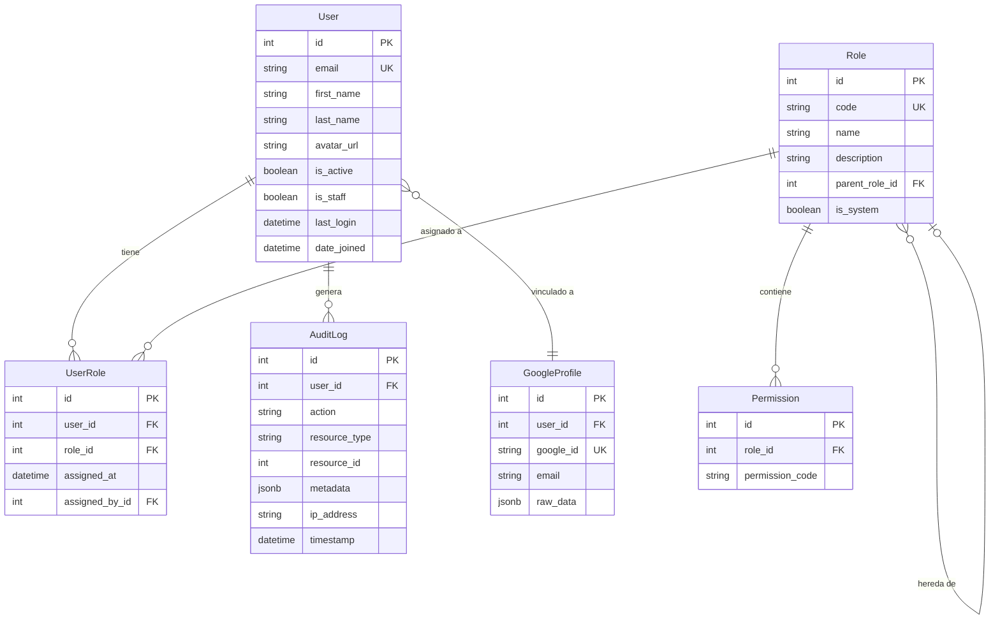
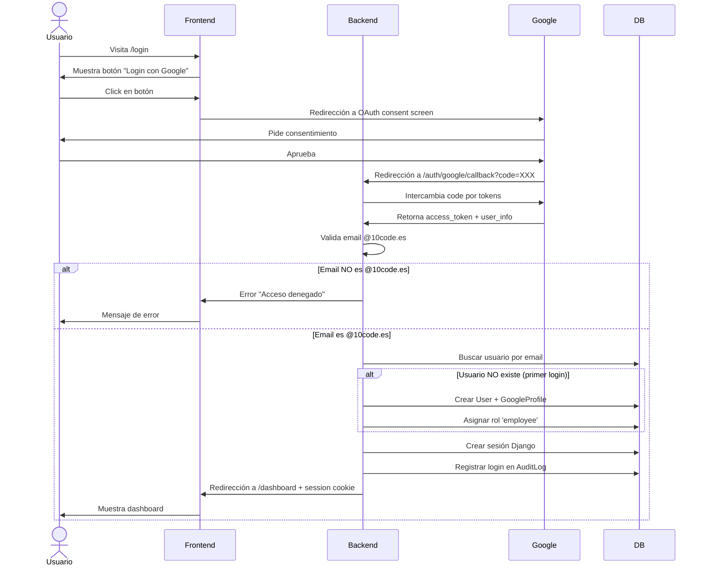
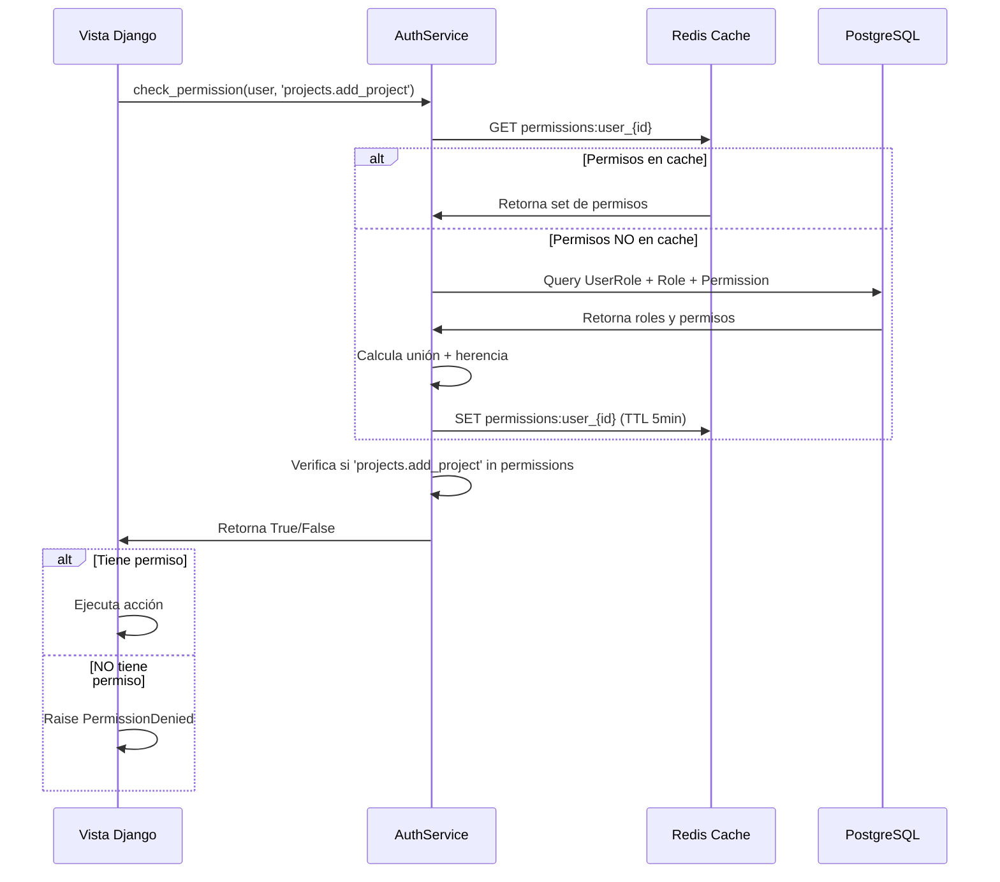
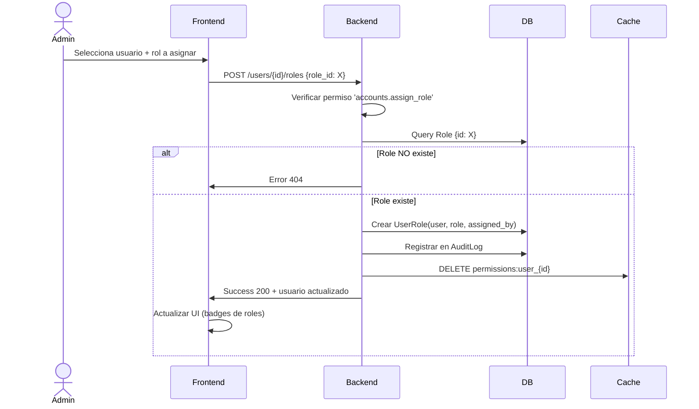

# FSD: Módulo de Autenticación y Usuarios

## Metadata

- **Módulo Django**: `apps/accounts`
- **Versión**: 1.0
- **Fecha de creación**: 2024-11-18
- **Última actualización**: 2024-11-18
- **Owner**: Juanje Márquez - 10Code
- **Estado**: Approved
- **Prioridad**: Crítica (Fase 0 - Fundamentos)

---

## 1. Resumen Ejecutivo

El módulo de **Autenticación y Usuarios** proporciona la infraestructura de seguridad fundamental del sistema Intranet 10Code. Implementa autenticación corporativa mediante Single Sign-On (SSO) con Google Workspace, restringido exclusivamente al dominio `@10code.es`, eliminando la necesidad de gestión manual de contraseñas y aprovechando la infraestructura de identidad existente de la empresa.

Este módulo es la piedra angular del sistema, proporcionando el sistema de control de acceso basado en roles (RBAC) que gobierna todos los permisos en la aplicación. Gestiona usuarios, roles, permisos y sesiones, con capacidades completas de auditoría para cumplimiento normativo y trazabilidad de acciones críticas.

**Problema que resuelve**: Garantiza acceso seguro y controlado al sistema, elimina la fricción de gestión de contraseñas múltiples, centraliza la autorización con permisos granulares por módulo y acción, y proporciona trazabilidad completa de accesos para auditoría y cumplimiento de RGPD.

---

## 2. Contexto y Scope

### 2.1 Apps Django Involucradas

- **Principal**: `apps/accounts` (core del módulo)
- **Dependencias internas**: `apps/core` (modelos base, utilidades)

### 2.2 Dependencias de Otros Módulos

**Este módulo es fundacional**: No depende de otros módulos de negocio, pero **todos los demás módulos dependen de él** para autenticación y autorización.

**Módulos que consumirán este módulo**:

- `apps/hr` - Requiere roles y permisos de RR.HH.
- `apps/timetracking` - Validación de permisos para fichaje
- `apps/commercial` - Permisos comerciales
- `apps/projects` - Gestión de miembros y permisos de proyecto
- `apps/resources` - Autorización para reasignación de recursos
- `apps/financial` - Acceso restringido a datos financieros
- `apps/dashboards` - Visibilidad de KPIs según rol
- Todos los demás módulos del sistema

### 2.3 Integraciones Externas

| Integración | Propósito | Tipo | Criticidad |
|-------------|-----------|------|------------|
| **Google Workspace OAuth 2.0** | Autenticación corporativa SSO | OAuth 2.0 | Crítica |
| **Gmail API** (opcional) | Verificación adicional de dominio | REST API | Baja |

### 2.4 Roles de Usuario

| Rol | Código | Descripción | Nivel de Acceso |
|-----|--------|-------------|-----------------|
| **Superadmin** | `superadmin` | Administrador técnico del sistema | Total |
| **Dirección** | `director` | CEO/COO/CTO - Visión estratégica completa | Alto |
| **Director de Operaciones** | `operations_director` | Gestión de recursos y capacidad global | Alto |
| **RR.HH.** | `hr_manager` | Gestión de personal, ausencias, fichajes | Medio-Alto |
| **Comercial** | `sales` | Gestión de pipeline y oportunidades | Medio |
| **Gestor de Proyecto** | `project_manager` | Planificación y seguimiento de proyectos | Medio |
| **Product Manager** | `product_manager` | Gestión de backlog y priorización | Medio |
| **Technical Lead** | `tech_lead` | Liderazgo técnico y asignaciones | Medio |
| **Desarrollador** | `developer` | Ejecución de tareas y desarrollo | Bajo-Medio |
| **Diseñador** | `designer` | Diseño UX/UI | Bajo-Medio |
| **Empleado Base** | `employee` | Acceso básico (fichaje, tareas propias) | Bajo |

---

## 3. Requisitos Funcionales

### 3.1 User Stories (Enunciados)

#### Autenticación

- **US-AUTH-001**: Como empleado de 10Code, quiero iniciar sesión con mi cuenta de Google corporativa (@10code.es) para acceder al sistema sin gestionar contraseñas adicionales
- **US-AUTH-002**: Como usuario autenticado, quiero cerrar sesión para proteger mi cuenta cuando dejo mi equipo
- **US-AUTH-003**: Como sistema, debo rechazar intentos de login desde cuentas que no sean @10code.es para garantizar acceso exclusivo corporativo
- **US-AUTH-004**: Como administrador, quiero que las sesiones expiren tras 8 horas de inactividad para proteger cuentas olvidadas abiertas

#### Gestión de Usuarios

- **US-USER-001**: Como administrador, quiero crear usuarios manualmente para dar acceso anticipado antes de su primer login con Google
- **US-USER-002**: Como administrador, quiero desactivar usuarios temporalmente sin eliminar sus datos para gestionar ausencias prolongadas o bajas temporales
- **US-USER-003**: Como usuario, quiero ver y editar mi perfil personal (nombre, avatar, datos de contacto) para mantener mi información actualizada
- **US-USER-004**: Como administrador, quiero visualizar lista completa de usuarios con filtros (activo/inactivo, rol, departamento) para gestión eficiente

#### Roles y Permisos

- **US-PERM-001**: Como administrador, quiero asignar uno o múltiples roles a un usuario para definir sus capacidades en el sistema
- **US-PERM-002**: Como administrador, quiero crear roles personalizados con permisos específicos para adaptarme a necesidades organizativas particulares
- **US-PERM-003**: Como desarrollador del sistema, quiero verificar permisos de usuario antes de permitir acciones críticas para garantizar seguridad
- **US-PERM-004**: Como usuario, quiero ver claramente qué acciones puedo realizar en cada módulo para comprender mis capacidades

#### Auditoría

- **US-AUDIT-001**: Como administrador, quiero visualizar historial completo de logins (exitosos y fallidos) para detectar accesos sospechosos
- **US-AUDIT-002**: Como responsable de seguridad, quiero recibir alertas de intentos de login desde cuentas no autorizadas para respuesta rápida
- **US-AUDIT-003**: Como auditor, quiero exportar logs de acceso para cumplimiento normativo y auditorías externas
- **US-AUDIT-004**: Como sistema, debo registrar cambios en permisos críticos (elevación de privilegios, desactivación de usuarios) para trazabilidad completa

### 3.2 Reglas de Negocio Críticas

#### RN-AUTH (Autenticación)

1. **Dominio exclusivo**: SOLO cuentas `@10code.es` pueden autenticarse en el sistema. Cualquier intento con otro dominio debe ser rechazado con mensaje claro.

2. **Autenticación delegada**: El sistema NO gestiona contraseñas locales. Toda autenticación se delega a Google OAuth 2.0.

3. **Primer login automático**: Si un usuario con email `@10code.es` se autentica exitosamente por primera vez, el sistema debe:
   - Crear automáticamente su usuario
   - Asignar rol por defecto `employee`
   - Extraer datos básicos del perfil de Google (nombre, email, avatar)

4. **Sesiones seguras**:
   - Timeout de inactividad: 8 horas (configurable)
   - Cookie de sesión: `HttpOnly`, `Secure` (HTTPS), `SameSite=Lax`
   - Tokens CSRF obligatorios en todas las mutaciones

5. **Bloqueo de cuenta**: Tras 5 intentos fallidos de login en 15 minutos, bloquear temporalmente la cuenta por 30 minutos.

#### RN-RBAC (Roles y Permisos)

1. **Herencia de permisos**: Los roles pueden heredar permisos de un rol base (ej. `project_manager` hereda de `employee`).

2. **Permisos granulares**: Los permisos siguen el formato Django: `<app>.<action>_<model>` (ej. `projects.add_project`, `timetracking.approve_timeentry`).

3. **Rol múltiple**: Un usuario puede tener múltiples roles simultáneamente. Los permisos son la UNIÓN de todos sus roles.

4. **Superadmin inviolable**: El rol `superadmin` siempre tiene TODOS los permisos, sin posibilidad de restricción.

5. **Cambio de permisos auditado**: Cualquier modificación de roles o permisos debe quedar registrada en log de auditoría con: quién cambió, qué cambió, cuándo, y desde qué IP.

#### RN-DATA (Protección de Datos)

1. **Datos mínimos**: Solo almacenar datos estrictamente necesarios del perfil de Google (email, nombre, avatar). NO almacenar tokens de acceso a largo plazo.

2. **Anonimización en desactivación**: Cuando un usuario se desactiva permanentemente (ej. baja laboral), su email debe anonimizarse pero preservar referencias de auditoría (ej. `usuario_[id]_anonimizado@10code.es`).

3. **RGPD - Portabilidad**: El usuario debe poder exportar todos sus datos personales en formato JSON estructurado.

4. **RGPD - Derecho al olvido**: Tras 4 años de inactividad, los datos personales no esenciales deben ser eliminados automáticamente.

---

## 4. Diseño Técnico

### 4.1 Modelos Django

#### Diagrama de Relaciones



#### Modelo `User` (Customizado)

**Extiende**: `django.contrib.auth.models.AbstractUser`

**Campos clave**:

- `email` (EmailField, unique, primary identifier)
- `first_name`, `last_name` (extraídos de Google)
- `avatar_url` (URL del avatar de Google)
- `is_active` (para desactivación sin borrado)
- `is_staff` (acceso a Django Admin)
- `last_login`, `date_joined` (timestamps automáticos)

**Métodos clave**:

- `get_full_name()` → Nombre completo
- `has_role(role_code)` → Verificar si tiene rol específico
- `has_perm(permission)` → Override para RBAC custom
- `get_all_permissions()` → Unión de permisos de todos sus roles

**Manager custom**: `UserManager` para crear usuarios con email como username

#### Modelo `GoogleProfile`

**Campos clave**:

- `user` (OneToOneField a User)
- `google_id` (único, ID de Google)
- `email` (email verificado de Google)
- `raw_data` (JSONField con datos extra del perfil)

**Propósito**: Vincular cuenta Django con identidad Google OAuth

#### Modelo `Role`

**Campos clave**:

- `code` (único, slug-friendly, ej. `project_manager`)
- `name` (display name, ej. "Gestor de Proyecto")
- `description` (texto descriptivo del rol)
- `parent_role` (ForeignKey a sí mismo, para herencia)
- `is_system` (booleano, roles predefinidos no editables)

**Métodos clave**:

- `get_all_permissions()` → Incluye permisos heredados del parent
- `get_inherited_roles()` → Cadena completa de herencia

#### Modelo `UserRole` (Tabla de unión)

**Campos clave**:

- `user` (ForeignKey a User)
- `role` (ForeignKey a Role)
- `assigned_at` (timestamp)
- `assigned_by` (ForeignKey a User, quién asignó el rol)

**Constraints**:

- Unique constraint en (`user`, `role`) para evitar duplicados

#### Modelo `Permission`

**Campos clave**:

- `role` (ForeignKey a Role)
- `permission_code` (string, formato Django: `app.action_model`)

**Propósito**: Tabla de unión entre roles y permisos granulares

#### Modelo `AuditLog`

**Campos clave**:

- `user` (ForeignKey a User, nullable para eventos del sistema)
- `action` (string: `login`, `logout`, `permission_change`, `password_reset`, etc.)
- `resource_type` (ej. `User`, `Role`, `Project`)
- `resource_id` (ID del recurso afectado)
- `metadata` (JSONField con detalles adicionales)
- `ip_address` (IP del cliente)
- `timestamp` (automático)

**Índices**:

- `user_id`, `timestamp` (queries frecuentes por usuario)
- `action`, `timestamp` (filtrar por tipo de evento)

### 4.2 Service Layer

#### `UserService`

**Funciones principales**:

1. **`create_user_from_google(google_profile_data: dict) -> User`**
   - Crea usuario automáticamente tras primer login OAuth exitoso
   - Extrae datos de perfil de Google
   - Asigna rol por defecto `employee`
   - Registra evento en audit log

2. **`create_user_manually(email: str, first_name: str, last_name: str, roles: list, created_by: User) -> User`**
   - Creación manual por administrador
   - Valida dominio @10code.es
   - Asigna roles especificados
   - Audita la creación

3. **`deactivate_user(user: User, deactivated_by: User, reason: str) -> None`**
   - Marca `is_active = False`
   - Invalida sesiones activas
   - Audita desactivación con razón
   - NO elimina datos (soft delete)

4. **`update_user_profile(user: User, profile_data: dict) -> User`**
   - Actualiza datos editables (nombre, avatar opcional)
   - Valida campos
   - No permite cambiar email (controlado por Google)

5. **`anonymize_user(user: User) -> None`**
   - Anonimiza email: `usuario_[id]_anonimizado@10code.es`
   - Limpia datos personales opcionales
   - Preserva referencias de auditoría

#### `RoleService`

**Funciones principales**:

1. **`assign_role_to_user(user: User, role: Role, assigned_by: User) -> UserRole`**
   - Asigna rol a usuario
   - Verifica que assigned_by tenga permisos
   - Audita asignación
   - Invalida cache de permisos del usuario

2. **`remove_role_from_user(user: User, role: Role, removed_by: User) -> None`**
   - Elimina rol de usuario
   - Audita remoción
   - Invalida cache de permisos

3. **`create_custom_role(code: str, name: str, parent_role: Role, permissions: list, created_by: User) -> Role`**
   - Crea rol personalizado
   - Valida code único
   - Configura herencia de parent_role
   - Asigna permisos especificados

4. **`get_user_effective_permissions(user: User) -> set`**
   - Calcula unión de permisos de todos sus roles
   - Incluye permisos heredados
   - Cachea resultado (5 minutos)

#### `AuthService`

**Funciones principales**:

1. **`authenticate_with_google(auth_code: str) -> tuple[User, str]`**
   - Intercambia código OAuth por tokens
   - Valida dominio @10code.es
   - Crea usuario si es primer login
   - Registra login exitoso en audit log
   - Retorna (user, session_token)

2. **`validate_session(session_token: str) -> User | None`**
   - Valida token de sesión
   - Verifica timeout de inactividad
   - Retorna usuario o None si inválido

3. **`logout_user(user: User) -> None`**
   - Invalida sesión actual
   - Registra logout en audit log

4. **`check_permission(user: User, permission: str) -> bool`**
   - Verifica si usuario tiene permiso específico
   - Consulta cache primero
   - Si no está en cache, calcula y cachea

#### `AuditService`

**Funciones principales**:

1. **`log_action(user: User, action: str, resource_type: str, resource_id: int, metadata: dict, request: HttpRequest) -> AuditLog`**
   - Crea entrada en audit log
   - Extrae IP de request
   - Almacena metadata como JSON

2. **`get_user_audit_trail(user: User, filters: dict) -> QuerySet[AuditLog]`**
   - Retorna historial de auditoría del usuario
   - Soporta filtros: fecha desde/hasta, acción, recurso

3. **`export_audit_logs(filters: dict) -> str`**
   - Exporta logs en formato CSV/JSON
   - Para cumplimiento normativo
   - Aplica filtros especificados

### 4.3 Vistas/Endpoints (Inertia)

#### Rutas de Autenticación

| Ruta | Método | Vista | Propósito |
|------|--------|-------|-----------|
| `/login` | GET | `login_view` | Página de login, redirecciona a Google OAuth |
| `/auth/google/callback` | GET | `google_oauth_callback` | Callback de Google, procesa código OAuth |
| `/logout` | POST | `logout_view` | Cierra sesión del usuario |

#### Rutas de Gestión de Usuarios

| Ruta | Método | Vista | Propósito |
|------|--------|-------|-----------|
| `/users` | GET | `users_index` | Lista de usuarios con filtros |
| `/users/create` | GET | `users_create` | Formulario de creación manual |
| `/users` | POST | `users_store` | Crear usuario |
| `/users/{id}` | GET | `users_show` | Ver detalle de usuario |
| `/users/{id}/edit` | GET | `users_edit` | Formulario de edición |
| `/users/{id}` | PUT/PATCH | `users_update` | Actualizar usuario |
| `/users/{id}/deactivate` | POST | `users_deactivate` | Desactivar usuario |
| `/users/{id}/roles` | POST | `users_assign_role` | Asignar rol |
| `/users/{id}/roles/{role_id}` | DELETE | `users_remove_role` | Quitar rol |

#### Rutas de Gestión de Roles

| Ruta | Método | Vista | Propósito |
|------|--------|-------|-----------|
| `/roles` | GET | `roles_index` | Lista de roles |
| `/roles/create` | GET | `roles_create` | Formulario de creación de rol |
| `/roles` | POST | `roles_store` | Crear rol personalizado |
| `/roles/{id}` | GET | `roles_show` | Ver detalle de rol y permisos |
| `/roles/{id}/permissions` | PUT | `roles_update_permissions` | Actualizar permisos del rol |

#### Rutas de Perfil de Usuario

| Ruta | Método | Vista | Propósito |
|------|--------|-------|-----------|
| `/profile` | GET | `profile_show` | Ver mi perfil |
| `/profile/edit` | GET | `profile_edit` | Editar mi perfil |
| `/profile` | PUT | `profile_update` | Actualizar mi perfil |
| `/profile/export` | GET | `profile_export` | Exportar mis datos (RGPD) |

#### Rutas de Auditoría

| Ruta | Método | Vista | Propósito |
|------|--------|-------|-----------|
| `/audit` | GET | `audit_index` | Lista de logs de auditoría |
| `/audit/export` | GET | `audit_export` | Exportar logs |

### 4.4 Frontend (Inertia Pages - React + TypeScript)

#### Estructura de Páginas

```markdown
frontend/Pages/
├── Auth/
│   ├── Login.tsx          # Página de login (botón Google OAuth)
│   ├── Callback.tsx       # Procesando callback (loader)
│   └── Unauthorized.tsx   # Acceso denegado
├── Users/
│   ├── Index.tsx          # Lista de usuarios con tabla y filtros
│   ├── Create.tsx         # Formulario de creación manual
│   ├── Show.tsx           # Detalle de usuario (perfil, roles, actividad)
│   ├── Edit.tsx           # Formulario de edición
│   └── Partials/
│       ├── UserCard.tsx   # Card de usuario
│       ├── RolesBadges.tsx# Badges de roles
│       └── AuditTimeline.tsx # Timeline de auditoría
├── Roles/
│   ├── Index.tsx          # Lista de roles
│   ├── Create.tsx         # Crear rol personalizado
│   ├── Show.tsx           # Detalle de rol con permisos
│   └── Partials/
│       └── PermissionsTree.tsx # Árbol de permisos por módulo
└── Profile/
    ├── Show.tsx           # Mi perfil
    ├── Edit.tsx           # Editar mi perfil
    └── Export.tsx         # Exportar mis datos
```

#### Componentes Compartidos Clave

1. **`PermissionGuard.tsx`**
   - HOC que envuelve componentes protegidos
   - Verifica permisos antes de renderizar
   - Muestra mensaje de acceso denegado si no tiene permiso

2. **`RoleSelector.tsx`**
   - Selector multi-opción de roles
   - Con búsqueda y agrupación
   - Muestra permisos efectivos al seleccionar

3. **`AuditLogViewer.tsx`**
   - Tabla filtrable de logs de auditoría
   - Timeline visual
   - Exportación a CSV

4. **`UserAvatar.tsx`**
   - Avatar de usuario con fallback a iniciales
   - Tooltip con nombre completo y rol principal

---

## 5. Flujos de Datos Críticos

### 5.1 Flujo de Autenticación con Google OAuth



### 5.2 Flujo de Verificación de Permisos



### 5.3 Flujo de Asignación de Rol



---

## 6. Validaciones y Permisos

### 6.1 Validaciones de Negocio

#### Validaciones de Usuario

| Campo | Validación | Mensaje de Error |
|-------|------------|------------------|
| `email` | Formato válido + dominio @10code.es | "Solo emails corporativos @10code.es son permitidos" |
| `email` | Único en el sistema | "Ya existe un usuario con este email" |
| `first_name` | No vacío, max 150 chars | "Nombre es requerido" |
| `last_name` | No vacío, max 150 chars | "Apellido es requerido" |

#### Validaciones de Rol

| Campo | Validación | Mensaje de Error |
|-------|------------|------------------|
| `code` | Slug-friendly, único, max 50 chars | "Código de rol debe ser único y sin espacios" |
| `parent_role` | No crear ciclos de herencia | "No se puede crear herencia circular de roles" |
| `is_system` | Roles de sistema NO editables | "Los roles de sistema no pueden modificarse" |

#### Validaciones de Asignación de Rol

| Validación | Condición | Mensaje de Error |
|------------|-----------|------------------|
| Usuario activo | `user.is_active == True` | "No se puede asignar roles a usuario desactivado" |
| Rol existente | Rol debe existir en DB | "Rol no encontrado" |
| Permiso de asignador | assigned_by debe tener `accounts.assign_role` | "No tienes permiso para asignar roles" |

### 6.2 Permisos RBAC por Rol

#### Matriz de Permisos (Resumen - Módulo Accounts)

| Permiso | Superadmin | Director | Ops Director | HR Manager | Employee |
|---------|------------|----------|--------------|------------|----------|
| `accounts.view_user` | ✅ | ✅ | ✅ | ✅ | ❌ (solo propio perfil) |
| `accounts.add_user` | ✅ | ✅ | ✅ | ✅ | ❌ |
| `accounts.change_user` | ✅ | ✅ | ✅ | ✅ (limitado) | ❌ |
| `accounts.delete_user` | ✅ | ✅ | ❌ | ❌ | ❌ |
| `accounts.assign_role` | ✅ | ✅ | ✅ (limitado) | ❌ | ❌ |
| `accounts.view_auditlog` | ✅ | ✅ | ✅ | ✅ (limitado) | ❌ |
| `accounts.export_auditlog` | ✅ | ✅ | ✅ | ❌ | ❌ |
| `accounts.add_role` | ✅ | ✅ | ❌ | ❌ | ❌ |
| `accounts.change_role` | ✅ | ✅ | ❌ | ❌ | ❌ |

**Nota**: Esta matriz es de referencia. Los permisos finales se configuran en fixtures de datos iniciales.

### 6.3 Verificación de Permisos en Código

#### En Vistas Django

```python
# Decorador para vistas que requieren permisos
@login_required
@permission_required('accounts.add_user', raise_exception=True)
def users_create(request):
    # ...

# Verificación manual en vista
from django.core.exceptions import PermissionDenied

def users_assign_role(request, user_id):
    if not request.user.has_perm('accounts.assign_role'):
        raise PermissionDenied("No tienes permiso para asignar roles")
    # ...
```

#### En Service Layer

```python
# AuthService.check_permission() para uso programático
from apps.accounts.services import AuthService

def some_business_logic(user, project):
    if not AuthService.check_permission(user, 'projects.delete_project'):
        raise PermissionDenied("No puedes eliminar este proyecto")
    # ...
```

#### En Frontend (React)

```tsx
// HOC PermissionGuard
<PermissionGuard permission="accounts.add_user" fallback={<AccessDenied />}>
  <CreateUserForm />
</PermissionGuard>

// Props desde backend
export default function UsersIndex({ users, permissions }) {
  return (
    <>
      {permissions.can_create && (
        <Link href="/users/create">Crear Usuario</Link>
      )}
      {/* ... */}
    </>
  )
}
```

---

## 7. Integraciones

### 7.1 Integración con Google Workspace OAuth 2.0

#### Configuración

**Dependencia**: `django-allauth` con provider `google`

**Variables de entorno requeridas**:

```bash
GOOGLE_OAUTH_CLIENT_ID=xxx.apps.googleusercontent.com
GOOGLE_OAUTH_CLIENT_SECRET=GOCSPX-xxx
GOOGLE_OAUTH_REDIRECT_URI=https://intranet.10code.es/auth/google/callback
```

**Scopes solicitados**:

- `openid` (identificación básica)
- `email` (dirección de email)
- `profile` (nombre, avatar)

#### Flujo OAuth

1. Usuario hace click en "Login con Google"
2. Redirección a `https://accounts.google.com/o/oauth2/v2/auth` con parámetros:
   - `client_id`
   - `redirect_uri`
   - `scope`
   - `response_type=code`
3. Usuario aprueba en Google
4. Google redirecciona a `redirect_uri` con `code` en query params
5. Backend intercambia `code` por `access_token` mediante POST a `https://oauth2.googleapis.com/token`
6. Backend usa `access_token` para obtener info del usuario desde `https://www.googleapis.com/oauth2/v2/userinfo`
7. Backend valida dominio y crea/actualiza usuario

#### Manejo de Errores

| Error | Código HTTP | Acción |
|-------|-------------|--------|
| Código OAuth inválido | 400 | Redirigir a /login con mensaje "Error de autenticación, intenta de nuevo" |
| Email no @10code.es | 403 | Mostrar "Solo empleados de 10Code pueden acceder" |
| Error de red con Google | 503 | Mostrar "Servicio de autenticación temporalmente no disponible" |

### 7.2 Integración Interna con Otros Módulos

**Todos los módulos del sistema consumen este módulo para**:

1. **Verificar autenticación**: Middleware de Django verifica sesión activa
2. **Verificar permisos**: Llamadas a `AuthService.check_permission()` o decoradores Django
3. **Obtener usuario actual**: `request.user` disponible en todas las vistas
4. **Auditar acciones**: Llamadas a `AuditService.log_action()` desde otros módulos

**Patrón de comunicación**:

- **80%**: Service Layer - otros módulos llaman a `AuthService` y `RoleService`
- **20%**: Signals Django - eventos de cambio de usuario/rol disparan signals que otros módulos escuchan

**Ejemplo de Signal**:

```python
# apps/accounts/signals.py
from django.db.models.signals import post_save
from django.dispatch import receiver
from apps.accounts.models import UserRole

@receiver(post_save, sender=UserRole)
def invalidate_user_permissions_cache(sender, instance, **kwargs):
    """Invalida cache de permisos cuando cambian roles."""
    cache.delete(f'permissions:user_{instance.user.id}')
```

---

## 8. Testing

### 8.1 Unit Tests (Services)

**Cobertura objetivo**: 90% en services.py

#### Tests de `UserService`

```python
# apps/accounts/tests/test_services.py

@pytest.mark.django_db
class TestUserService:
    def test_create_user_from_google_success(self):
        """Crear usuario automáticamente desde datos de Google."""
        google_data = {
            'email': 'juan@10code.es',
            'given_name': 'Juan',
            'family_name': 'Pérez',
            'picture': 'https://lh3.googleusercontent.com/...'
        }
        
        user = UserService.create_user_from_google(google_data)
        
        assert user.email == 'juan@10code.es'
        assert user.first_name == 'Juan'
        assert user.has_role('employee')
        assert AuditLog.objects.filter(user=user, action='user_created').exists()

    def test_create_user_from_google_invalid_domain(self):
        """Rechazar creación si email no es @10code.es."""
        google_data = {
            'email': 'juan@gmail.com',
            'given_name': 'Juan',
            'family_name': 'Pérez'
        }
        
        with pytest.raises(ValidationError, match="Solo emails @10code.es"):
            UserService.create_user_from_google(google_data)

    def test_deactivate_user_success(self):
        """Desactivar usuario correctamente."""
        user = UserFactory()
        admin = UserFactory(permissions=['accounts.delete_user'])
        
        UserService.deactivate_user(user, deactivated_by=admin, reason="Baja voluntaria")
        
        user.refresh_from_db()
        assert not user.is_active
        assert AuditLog.objects.filter(
            user=user,
            action='user_deactivated',
            metadata__reason='Baja voluntaria'
        ).exists()
```

#### Tests de `RoleService`

```python
@pytest.mark.django_db
class TestRoleService:
    def test_assign_role_to_user(self):
        """Asignar rol a usuario."""
        user = UserFactory()
        role = RoleFactory(code='project_manager')
        admin = UserFactory(permissions=['accounts.assign_role'])
        
        user_role = RoleService.assign_role_to_user(user, role, assigned_by=admin)
        
        assert user.has_role('project_manager')
        assert user_role.assigned_by == admin
        assert AuditLog.objects.filter(action='role_assigned').exists()

    def test_get_user_effective_permissions_with_inheritance(self):
        """Calcular permisos efectivos con herencia de roles."""
        base_role = RoleFactory(code='employee', permissions=['accounts.view_user'])
        manager_role = RoleFactory(
            code='project_manager',
            parent_role=base_role,
            permissions=['projects.add_project', 'projects.change_project']
        )
        user = UserFactory()
        RoleService.assign_role_to_user(user, manager_role, assigned_by=user)
        
        permissions = RoleService.get_user_effective_permissions(user)
        
        assert 'accounts.view_user' in permissions  # Heredado
        assert 'projects.add_project' in permissions
        assert 'projects.change_project' in permissions
```

#### Tests de `AuthService`

```python
@pytest.mark.django_db
class TestAuthService:
    def test_check_permission_cached(self):
        """Verificar que permisos se cachean correctamente."""
        user = UserFactory()
        role = RoleFactory(permissions=['projects.add_project'])
        RoleService.assign_role_to_user(user, role, assigned_by=user)
        
        # Primera llamada - query a DB
        with pytest.assertNumQueries(3):
            result1 = AuthService.check_permission(user, 'projects.add_project')
        
        # Segunda llamada - desde cache
        with pytest.assertNumQueries(0):
            result2 = AuthService.check_permission(user, 'projects.add_project')
        
        assert result1 == result2 == True
```

### 8.2 Integration Tests (Views)

**Cobertura objetivo**: 70% en views.py

#### Tests de autenticación

```python
# apps/accounts/tests/test_views.py

@pytest.mark.django_db
class TestAuthViews:
    def test_login_redirects_to_google(self, client):
        """Vista de login redirige a Google OAuth."""
        response = client.get('/login')
        
        assert response.status_code == 302
        assert 'accounts.google.com' in response['Location']

    def test_google_callback_creates_user_first_time(self, client, mocker):
        """Callback de Google crea usuario en primer login."""
        # Mock Google OAuth response
        mock_exchange = mocker.patch('allauth.socialaccount.providers.google.views.GoogleOAuth2Adapter.complete_login')
        mock_exchange.return_value = SocialLogin(
            user=None,
            account=SocialAccount(
                provider='google',
                uid='123456',
                extra_data={
                    'email': 'nuevo@10code.es',
                    'given_name': 'Nuevo',
                    'family_name': 'Usuario'
                }
            )
        )
        
        response = client.get('/auth/google/callback?code=fake_code')
        
        assert response.status_code == 302  # Redirect to dashboard
        assert User.objects.filter(email='nuevo@10code.es').exists()
        
        user = User.objects.get(email='nuevo@10code.es')
        assert user.has_role('employee')

    def test_google_callback_rejects_non_10code_email(self, client, mocker):
        """Callback rechaza emails que no son @10code.es."""
        mock_exchange = mocker.patch('allauth.socialaccount.providers.google.views.GoogleOAuth2Adapter.complete_login')
        mock_exchange.return_value = SocialLogin(
            account=SocialAccount(
                extra_data={'email': 'usuario@gmail.com'}
            )
        )
        
        response = client.get('/auth/google/callback?code=fake_code')
        
        assert response.status_code == 403
        assert not User.objects.filter(email='usuario@gmail.com').exists()
```

#### Tests de gestión de usuarios

```python
@pytest.mark.django_db
class TestUserViews:
    def test_users_index_requires_authentication(self, client):
        """Lista de usuarios requiere autenticación."""
        response = client.get('/users')
        
        assert response.status_code == 302  # Redirect to login
        assert '/login' in response['Location']

    def test_users_index_returns_users_list(self, authenticated_client):
        """Lista de usuarios retorna datos correctos."""
        UserFactory.create_batch(5)
        
        response = authenticated_client.get('/users')
        
        assert response.status_code == 200
        props = response.context['props']
        assert len(props['users']) == 6  # 5 + authenticated user

    def test_users_create_requires_permission(self, authenticated_client):
        """Crear usuario requiere permiso específico."""
        response = authenticated_client.post('/users', data={
            'email': 'nuevo@10code.es',
            'first_name': 'Nuevo',
            'last_name': 'Usuario'
        })
        
        assert response.status_code == 403  # Permission denied
```

### 8.3 E2E Tests (Playwright)

**Cobertura objetivo**: 5-10 flujos críticos

#### Test E2E de login completo

```typescript
// tests/e2e/auth.spec.ts

import { test, expect } from '@playwright/test'

test.describe('Authentication Flow', () => {
  test('should login with Google OAuth successfully', async ({ page }) => {
    // Ir a página de login
    await page.goto('/login')
    
    // Verificar que muestra botón de Google
    await expect(page.locator('text=Iniciar sesión con Google')).toBeVisible()
    
    // Click en botón (en test, mockeamos respuesta de Google)
    await page.click('text=Iniciar sesión con Google')
    
    // Simular callback exitoso
    await page.goto('/auth/google/callback?code=test_code')
    
    // Verificar redirección a dashboard
    await expect(page).toHaveURL(/\/dashboard/)
    
    // Verificar que muestra nombre de usuario en header
    await expect(page.locator('[data-testid="user-menu"]')).toContainText('Usuario Test')
  })

  test('should reject login from non-10code email', async ({ page }) => {
    await page.goto('/auth/google/callback?code=invalid_domain_code')
    
    // Verificar mensaje de error
    await expect(page.locator('.error-message')).toContainText('Solo empleados de 10Code')
    
    // Verificar que no hay sesión activa
    await page.goto('/dashboard')
    await expect(page).toHaveURL(/\/login/)
  })
})
```

#### Test E2E de gestión de usuarios

```typescript
// tests/e2e/users.spec.ts

test.describe('User Management', () => {
  test('admin should create new user manually', async ({ page }) => {
    // Login como admin
    await loginAsAdmin(page)
    
    // Navegar a usuarios
    await page.click('text=Usuarios')
    await expect(page).toHaveURL('/users')
    
    // Click en crear usuario
    await page.click('[data-testid="create-user-btn"]')
    
    // Llenar formulario
    await page.fill('input[name="email"]', 'nuevo.empleado@10code.es')
    await page.fill('input[name="first_name"]', 'Nuevo')
    await page.fill('input[name="last_name"]', 'Empleado')
    await page.selectOption('select[name="role"]', 'developer')
    
    // Enviar formulario
    await page.click('button[type="submit"]')
    
    // Verificar creación exitosa
    await expect(page.locator('.success-message')).toContainText('Usuario creado')
    await expect(page).toHaveURL(/\/users\/\d+/)
    await expect(page.locator('h1')).toContainText('Nuevo Empleado')
  })
})
```

### 8.4 Test Fixtures y Factories

```python
# apps/accounts/tests/factories.py

import factory
from apps.accounts.models import User, Role, UserRole, GoogleProfile

class UserFactory(factory.django.DjangoModelFactory):
    class Meta:
        model = User
    
    email = factory.Sequence(lambda n: f'user{n}@10code.es')
    first_name = factory.Faker('first_name')
    last_name = factory.Faker('last_name')
    is_active = True
    
    @factory.post_generation
    def permissions(self, create, extracted, **kwargs):
        """Asignar permisos al crear usuario en tests."""
        if not create or not extracted:
            return
        
        # Crear rol temporal con permisos especificados
        role = RoleFactory(permissions=extracted)
        UserRoleFactory(user=self, role=role)

class RoleFactory(factory.django.DjangoModelFactory):
    class Meta:
        model = Role
    
    code = factory.Sequence(lambda n: f'role_{n}')
    name = factory.Faker('job')
    is_system = False
    
    @factory.post_generation
    def permissions(self, create, extracted, **kwargs):
        """Asignar permisos al rol."""
        if not create or not extracted:
            return
        
        from apps.accounts.models import Permission
        for perm_code in extracted:
            Permission.objects.create(role=self, permission_code=perm_code)

class UserRoleFactory(factory.django.DjangoModelFactory):
    class Meta:
        model = UserRole
    
    user = factory.SubFactory(UserFactory)
    role = factory.SubFactory(RoleFactory)
    assigned_by = factory.SubFactory(UserFactory)

class GoogleProfileFactory(factory.django.DjangoModelFactory):
    class Meta:
        model = GoogleProfile
    
    user = factory.SubFactory(UserFactory)
    google_id = factory.Sequence(lambda n: f'google_id_{n}')
    email = factory.LazyAttribute(lambda obj: obj.user.email)
    raw_data = factory.Dict({
        'email_verified': True,
        'locale': 'es'
    })
```

---

## 9. Consideraciones

### 9.1 Performance

#### Optimizaciones Implementadas

1. **Caché de permisos**:
   - TTL: 5 minutos en Redis
   - Key: `permissions:user_{user_id}`
   - Invalidación automática al cambiar roles/permisos

2. **Queries optimizadas**:
   - `select_related('created_by', 'google_profile')` en lista de usuarios
   - `prefetch_related('roles__permissions')` al cargar permisos
   - Índices en campos frecuentes: `email`, `is_active`, `last_login`

3. **Sesiones en Redis**:
   - Evita queries a DB en cada request
   - TTL: 8 horas de inactividad

#### Puntos Calientes a Monitorear

- **Cálculo de permisos**: Query compleja con joins múltiples
  - **Mitigación**: Cache agresivo
- **Audit log writes**: INSERT en cada acción importante
  - **Mitigación**: Escrituras asíncronas con Celery para acciones no críticas

### 9.2 Seguridad

#### Medidas Implementadas

1. **Autenticación**:
   - OAuth 2.0 con Google (delegación de autenticación)
   - Sin contraseñas locales (elimina riesgo de brute force local)
   - Restricción estricta a dominio @10code.es

2. **Sesiones**:
   - Cookies con flags: `HttpOnly`, `Secure`, `SameSite=Lax`
   - Timeout de 8 horas configurable
   - Invalidación inmediata al cambiar roles/permisos críticos

3. **Tokens**:
   - CSRF tokens obligatorios en mutaciones
   - Rotación automática de tokens de sesión

4. **Rate Limiting** (futuro):
   - Máximo 5 intentos de login en 15 minutos
   - Bloqueo temporal de 30 minutos tras exceder límite

5. **Auditoría**:
   - Log de todas las acciones de autenticación y autorización
   - Almacenamiento inmutable de logs
   - Alertas en cambios de permisos elevados

#### Vulnerabilidades Consideradas

| Vulnerabilidad | Mitigación |
|----------------|------------|
| Session hijacking | Cookies seguras + HTTPS obligatorio + binding de IP (opcional) |
| Privilege escalation | Verificación de permisos en backend, no confiar en frontend |
| CSRF | Django CSRF middleware + Inertia headers |
| XSS | React escapa HTML automáticamente, sanitización en backend para HTML permitido |
| Audit log tampering | Tabla de auditoría de solo inserción, sin updates/deletes |

### 9.3 Escalabilidad

#### Capacidad Actual

- **MVP**: Soporta hasta 50 usuarios concurrentes sin degradación
- **Bottlenecks identificados**:
  - Cálculo de permisos sin cache (solucionado con Redis)
  - Escrituras masivas a audit log (mitigable con batch inserts)

#### Plan de Escalabilidad

1. **Fase 2 (50-200 usuarios)**:
   - Read replicas de PostgreSQL para queries de solo lectura
   - Separación de audit logs a tabla particionada por mes

2. **Fase 3 (200+ usuarios)**:
   - Sharding de sesiones en múltiples instancias Redis
   - Audit logs a sistema externo (ELK, Loki)
   - CDN para assets estáticos

3. **Fase 4 (SaaS multi-tenant)**:
   - Separación de roles/permisos por tenant
   - Pools de conexiones optimizados
   - Posible extracción a microservicio de autenticación

### 9.4 Mantenibilidad

#### Documentación

- **Código autodocumentado**: Docstrings en todas las funciones públicas
- **Type hints**: Obligatorios en Service Layer
- **Tests como documentación**: Tests describen comportamiento esperado

#### Monitoreo

Métricas clave a trackear:

- Tasa de login exitoso vs fallido
- Tiempo promedio de verificación de permisos
- Tamaño de tabla de audit logs
- Hit rate de cache de permisos
- Distribución de usuarios por rol

#### Deuda Técnica Conocida

1. **Herencia de roles limitada a 1 nivel**: Actualmente solo `parent_role` directo
   - **Plan futuro**: Implementar herencia recursiva si se necesita más complejidad

2. **Sin multi-factor authentication (MFA)**: Solo OAuth con Google
   - **Plan futuro**: Evaluar necesidad basado en análisis de riesgo

3. **Audit logs crecen indefinidamente**: Sin estrategia de archivado
   - **Plan futuro**: Implementar archivado automático tras 1 año

### 9.5 Cumplimiento Normativo (RGPD)

#### Datos Personales Almacenados

- Email corporativo (necesario para autenticación)
- Nombre y apellidos (necesario para identificación)
- Avatar URL (opcional, obtenido de Google)
- Histórico de logins (necesario para auditoría - 4 años)

#### Derechos del Usuario

1. **Acceso**: Usuario puede ver su perfil completo en `/profile`
2. **Portabilidad**: Exportación de datos en JSON desde `/profile/export`
3. **Rectificación**: Edición de nombre/apellidos en `/profile/edit` (email no editable, controlado por Google)
4. **Olvido**: Anonimización tras 4 años de inactividad (automático)

#### Consentimiento

- **Implícito**: Al usar cuenta corporativa @10code.es, se acepta política de privacidad corporativa
- **Explícito**: No requerido para empleados (relación laboral existente)

---

## 10. Referencias

### 10.1 Documentos Relacionados

- **PRD Global**: `docs/product_docs/PRD_Intranet_10Code.md` - Sección 4.1
- **SAD**: `docs/product_docs/SAD_Intranet_10Code.md` - Secciones 7 (Seguridad), 8 (Testing)
- **Marco de Documentación**: `docs/product_docs/.framework/marco-documentacion-tecnica-10code.md`

### 10.2 ADRs Relacionados

- **ADR-002**: Django + Inertia.js - Justifica arquitectura de autenticación sin API REST separada
- **ADR-004**: OAuth con Google Workspace - Decisión de autenticación delegada
- **ADR-008**: Service Layer Pattern - Justifica separación de lógica de autenticación

### 10.3 Documentación Externa

- **Django Authentication**: <https://docs.djangoproject.com/en/5.0/topics/auth/>
- **django-allauth**: <https://django-allauth.readthedocs.io/>
- **Google OAuth 2.0**: <https://developers.google.com/identity/protocols/oauth2>
- **OWASP Authentication Cheat Sheet**: <https://cheatsheetseries.owasp.org/cheatsheets/Authentication_Cheat_Sheet.html>

### 10.4 Código de Referencia

- **Django Permissions**: <https://docs.djangoproject.com/en/5.0/topics/auth/default/#permissions-and-authorization>
- **Role-Based Access Control patterns**: <https://www.django-rest-framework.org/api-guide/permissions/#custom-permissions>

---

## 11. Historial de Cambios

| Versión | Fecha | Autor | Cambios |
|---------|-------|-------|---------|
| 1.0 | 2024-11-18 | Juanje Márquez | Creación inicial del FSD de Autenticación y Usuarios |

---

## 12. Aprobaciones

### Estado de Aprobación

- ✅ **Lead Developer** (Juanje - 10Code): Aprobado para implementación
- 🔲 **Arquitecto de Software**: Revisión de coherencia con SAD (mismo rol en MVP)
- 🔲 **Product Owner**: Validación de alineación con requisitos de PRD

### Criterios de Aprobación

Este FSD se considera aprobado cuando:

1. ✅ Coherencia verificada con PRD (sección 4.1) y SAD (sección 7)
2. ✅ Cobertura completa de user stories para MVP
3. ✅ Diseño técnico claro y actionable para implementación
4. ✅ Estrategia de testing definida con cobertura >80%
5. ⏳ Implementación completada y desplegada en staging

---

> **Fin del FSD: Módulo de Autenticación y Usuarios v1.0**
>
> *Este documento define el QUÉ y CÓMO técnico del módulo de autenticación. Junto con el PRD y SAD, forma la base de documentación para implementación por desarrolladores humanos y agentes IA.*
